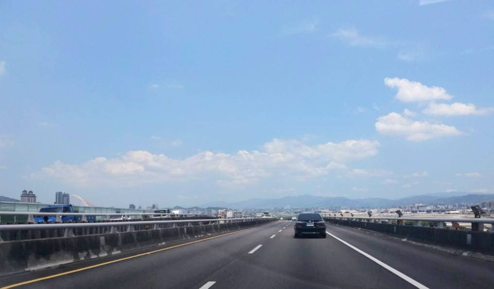
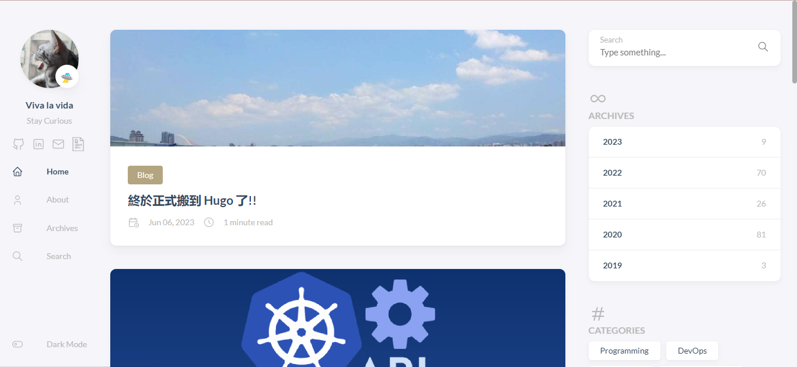

## TL; DR

本來以為今年的工作不會變動，殊不知在四月底突然有了新的機會，趁著一個禮拜的 gap week，來把一直想換很久的技術部落格換掉。

<!--more-->

## 架站歷史

原先是使用社群強大的 `Hexo + NexT`，並透過 `GitHub Page` 發佈，中間過渡期自己用 `Hugo + zozo` 架過一次用來記錄生活的 `ulanotes`。隨著部落格文章增長，發現在發佈編譯時真的愈等愈長，便陸續尋覓好看的 Hugo Theme，原本找到 `Eureka`，但發現有很多在 Hexo 有的功能這邊都沒有 (歸檔、search..)，再來找到也是數一數二用得多的 `Stack`。最後終於才發現在 Hexo 的舊愛 NexT，已經有支援 Hugo 靜態編譯了！繞了一圈還是回到 NexT 的懷抱 (◍•ᴗ•◍)

## 大感謝

紀錄一下上一版使用的 stack 所參考的部落格。

- https://siae.me/p/stack/
- https://irithys.com/
- https://www.vincentthh35.com/

## ulagraphy

但我還是很喜歡之前陪伴很久的 [`UlaGraphy`](https://wingardiumleviosaa.github.io/)，所以不會關站 XD  
Hexo Admin，還有 NexT 真的是爆炸好用!!! ಠ_ಠ

## 關於首圖
這張照片是第一份工作在當業務的時候拍的，雖然從畢業後到現在工程師這條路上繞了些路，但我相信一切都是最好的安排 ❀ ❀ ❀