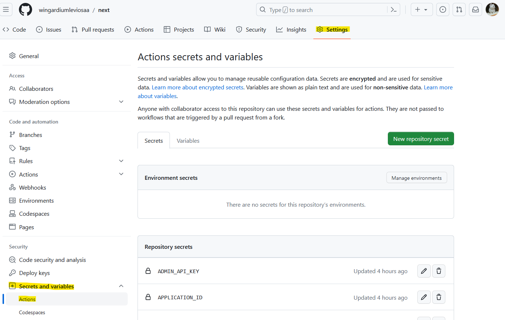
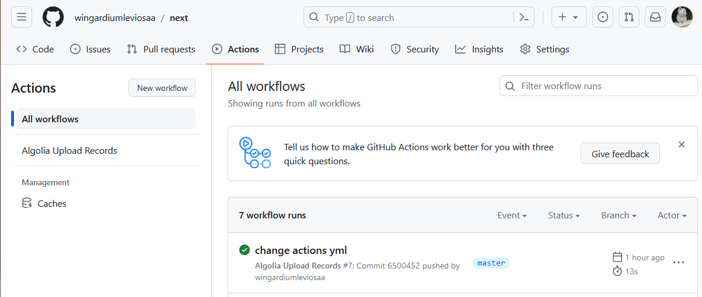
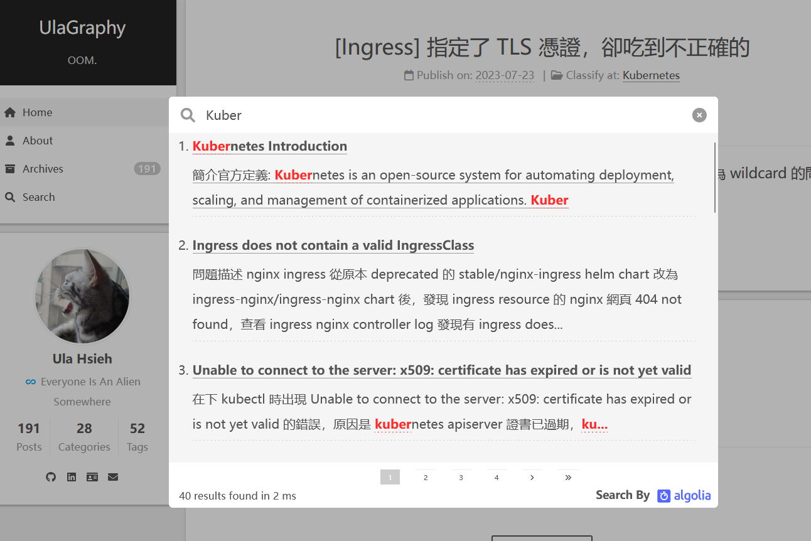

### TL; DR

本文紀錄如何在 Hugo 部落格中使用 Algolia 搜索文章，並設置 GitHub Action 在推上 GitHub 時自動更新到 Algolia。

<!--more-->

### 環境
- Hugo Version: Hugo 0.112.3 Extend
- Theme: NexT 4.5.2

### 步驟

#### 在本地生成索引檔案
NexT 本身支援生成 Aligolia JSON 格式的索引檔案，生成檔為 NexT themes 目錄的 `layout/_default/list.algoliaindexes.json`。僅須在 blog 目錄下的 config.yaml 開啟相關設定即可。

```yaml
outputFormats:
  # 生成 Algolia 索引文件
  AlgoliaIndexes:
    mediaType: application/json
    baseName: algolia
    isPlainText: true
    notAlternative: true

# 切換到 Algolia 搜索引擎，
outputs:
  home: ["HTML", "AlgoliaIndexes"]
 
params:
  algoliaSearch:
    enable: true
    appId: xxxx
    apiKey: xxxx
    indexName: xxxx
    hits:
      perPage: 10
    # 索引生成内容長度字數限制，Algolia 免費帳號單條索引限制字數為 10K
    limit: 1000
```

在本地使用 `Hugo` 指令靜態編譯，會在 public 目錄下看到 algolia.json 索引檔生成。

### 設定自動上傳至 Algolia

Algolia 提供幾種方式上傳索引檔：
- 直接登入 Algolia Portal，手動上傳
- 使用 cli 的方式設定環境變數，上傳指定索引檔
- 整合一些第三方的 gitlab action 自動上傳

其中第二跟第三種方式都是使用 API 的方式達成的，需要提供 Algolia 指定 Application 的連線資訊(Application ID, API Key, Index Name)。

本文使用第三種方式，在每次 git push 上 GitHub 時，自動上傳。

1. 新增 .github/workflows/main.yml CICD 檔案

```yaml
name: Algolia Upload Records
on:
  [push]
jobs:
  algolia:
    runs-on: ubuntu-latest
    steps:
      - name: Checkout
        uses: actions/checkout@v2
      - name: Upload Records
        uses: iChochy/Algolia-Upload-Records@main
        env:
          APPLICATION_ID: ${{secrets.APPLICATION_ID}}
          ADMIN_API_KEY: ${{secrets.ADMIN_API_KEY}}
          INDEX_NAME: ${{secrets.INDEX_NAME}}
          FILE_PATH: "public/algolia.json"
```

2. 在 repo 的 setting / Secrets and variables / Actions 中新增三個機敏資訊的 Secrets。



### 驗證

推上 GitHub 後，pipeline 會自動觸發並完成上傳，就能在網頁上啟用 Algolia 的搜索功能了!






### References
- [automatic-upload-algolia-index-with-action](https://lisenhui.cn/tech/automatic-upload-algolia-index-with-action.html)
- [iChochy/Algolia-Upload-Records](https://github.com/iChochy/Algolia-Upload-Records)