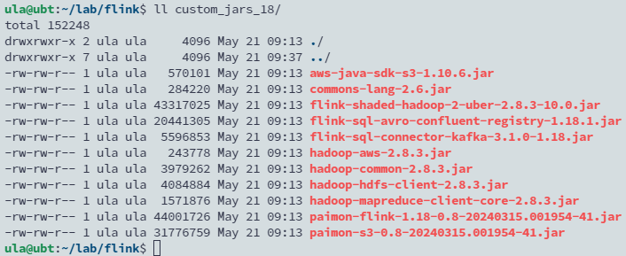
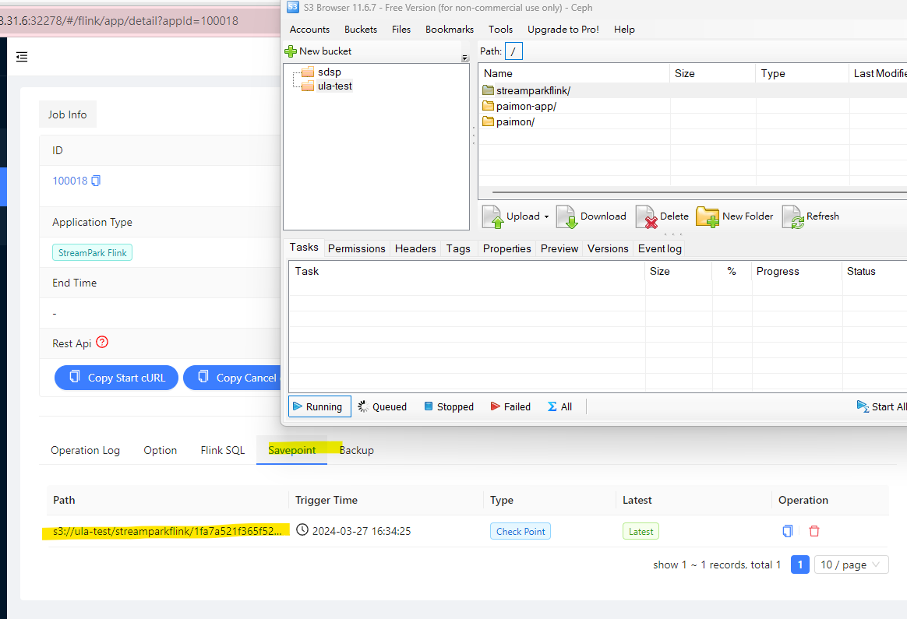

## TL; DR

本文記錄在 Kubernetes 上使用 Apache StreamPark 部署 Apache Flink 作業（無論是 session mode 還是 application mode），並指定 S3 來存儲 checkpoint 和 savepoint 的設定步驟。

<!--more-->


## 步驟

1. **自定義 Flink 鏡像**：確保在 Flink 插件目錄中包含`flink-s3-fs-hadoop` JAR，該 plugin 可以使 Flink 能夠與 S3 存儲交互。
    
    ```docker
    FROM flink:1.18.1-scala_2.12-java8
    COPY flink-s3-fs-hadoop-1.18.1.jar /opt/flink/plugins/s3-fs-hadoop/flink-s3-fs-hadoop-1.18.1.jar
    COPY ./custom_jars_18/*.jar /opt/flink/lib/
    ```
    
    並將其他必要的 jar 文件放置在庫目錄下，所需套件如下圖：
    
    
    
2. **在配置頁面設定 Dynamic Properties**:：在部署 Flink 作業時，需要指定多個動態屬性來配置state backend 以及 S3 中的 checkpoints 與 savepoints 路徑。使用以下屬性：
    
    ```diff
    -Dstate.backend.type=filesystem
    -Dstate.checkpoints.dir=s3://ula-test/streampark-cp
    -Dstate.savepoints.dir=s3://ula-test/streampark-sp
    -Ds3.access-key=0V2QOGVWCZAAK9DXA07P
    -Ds3.secret-key=60Kwr0A9jjH4A2ZOHgY74ZBUbpxgG2ALsoQ6uC4W
    -Ds3.endpoint=https://ceph-rgw.sdsp-stg.com
    -Ds3.path.style.access=true
    ```
    
    替換 S3 bucket paths, access key, secret key, and endpoint。
    
{}
✅ The `-Ds3.path.style.access=true` is crucial for compatibility with S3-like storage solutions that require path-style access, such as Minio or Ceph.
{}
    

## 結果

可以在 Job 頁面以及 S3 browser 看到  savepoint 的資訊：

