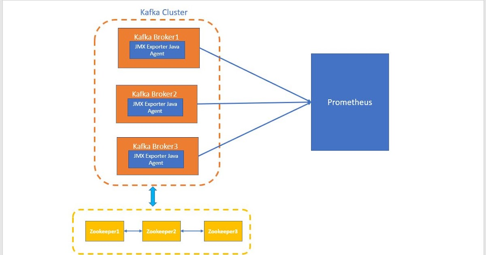
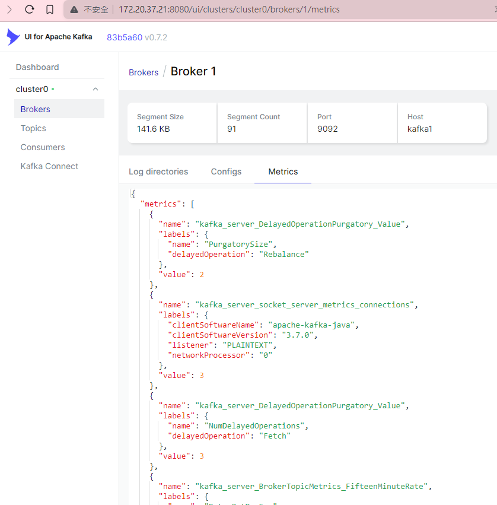
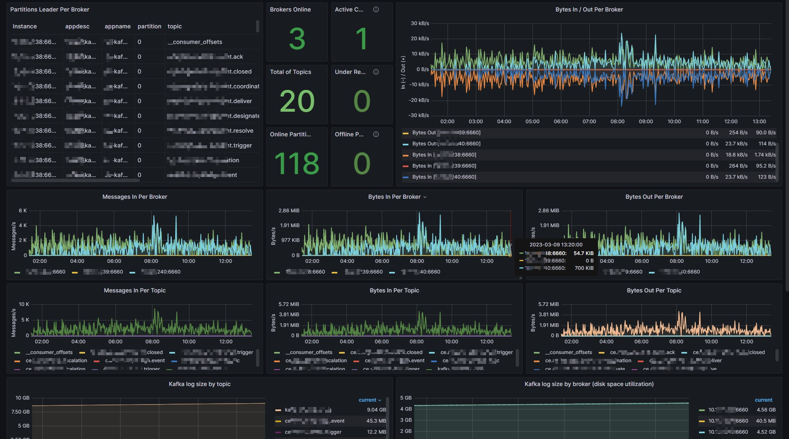
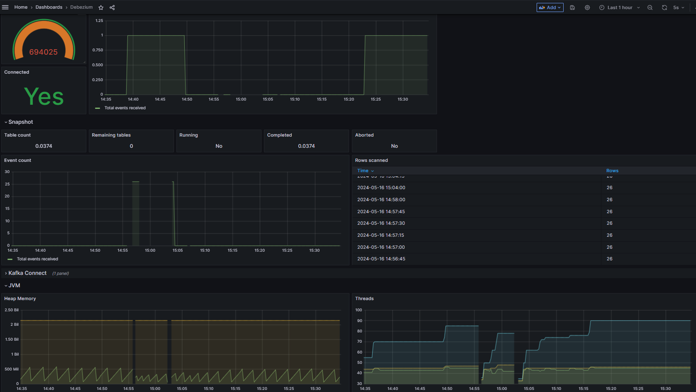

## TL; DR
用了 Kafka 這麼久，第一次啟用 JMX monitor 的功能，順便也把 Connect 的監控也做起來，還用了兩種不同的部署方式，以此篇記錄過程。

<!--more-->

## JMX 的監控有兩種部署方式

### **方法一：將 Java Agent 包在 Kafka Container 中**

這種方法是將 JMX Exporter 的 Java Agent 作為 Kafka 的依賴項目，與 Kafka 一起在同一個容器中運行。這樣可以簡化配置和部署，但也存在一些問題。例如：

1. **複雜的配置**：需要在 Kafka 的配置文件中添加 JMX Exporter 的設定，可能會增加配置的複雜性。
2. **監控的問題**：JMX Exporter 需要訪問 Kafka 的 JMX interface，可能會導致監控的延遲或不穩定。



### **方法二：另外部署一個 JMX Exporter**

這種方法是將 JMX Exporter 作為一個獨立的容器，與 Kafka 分開運行。這樣可以避免上述問題，但需要額外的配置和部署。例如：

1. **簡化配置**：可以將 JMX Exporter 的設定獨立於 Kafka 的配置文件中，減少複雜性。
2. **監控的穩定性**：JMX Exporter 可以專門負責監控 Kafka 的 JMX interface，提高監控的穩定性和準確性。


本篇記錄使用兩種做法個別實做 Kafka 跟 Kafka Connect (Debezium) 的監控，Kafka 使用方法一、Kafka connect 使用方法二。

## Prerequisite

因為方法二需要把 jmx exporter java agent 放在 java 運行環境中，所以需要重新包 Dockerfile，將 jar 檔跟 jmx config 檔放入指定路徑中。

- **Dockerfile**
    
    ```docker
    ARG DEBEZIUM_VERSION
    FROM quay.io/debezium/connect:${DEBEZIUM_VERSION}
    
    ARG JMX_AGENT_VERSION
    RUN mkdir /kafka/etc && cd /kafka/etc &&\
            curl -so jmx_prometheus_javaagent.jar \
            https://repo1.maven.org/maven2/io/prometheus/jmx/jmx_prometheus_javaagent/$JMX_AGENT_VERSION/jmx_prometheus_javaagent-$JMX_AGENT_VERSION.jar
    
    COPY config.yml /kafka/etc/config.yml
    ```
    
- **Debezium jmx config.yml**
    
    ```yaml
    startDelaySeconds: 0
    ssl: false
    lowercaseOutputName: false
    lowercaseOutputLabelNames: false
    rules:
    - pattern : "kafka.connect<type=connect-worker-metrics>([^:]+):"
      name: "kafka_connect_worker_metrics_$1"
    - pattern : "kafka.connect<type=connect-metrics, client-id=([^:]+)><>([^:]+)"
      name: "kafka_connect_metrics_$2"
      labels:
        client: "$1"
    - pattern: "debezium.([^:]+)<type=connector-metrics, context=([^,]+), server=([^,]+), key=([^>]+)><>RowsScanned"
      name: "debezium_metrics_RowsScanned"
      labels:
        plugin: "$1"
        name: "$3"
        context: "$2"
        table: "$4"
    - pattern: "debezium.([^:]+)<type=connector-metrics, server=([^,]+), task=([^,]+), context=([^,]+), database=([^>]+)>([^:]+)"
      name: "debezium_metrics_$6"
      labels:
        plugin: "$1"
        name: "$2"
        task: "$3"
        context: "$4"
        database: "$5"
    - pattern: "debezium.([^:]+)<type=connector-metrics, server=([^,]+), task=([^,]+), context=([^>]+)>([^:]+)"
      name: "debezium_metrics_$5"
      labels:
        plugin: "$1"
        name: "$2"
        task: "$3"
        context: "$4"
    - pattern: "debezium.([^:]+)<type=connector-metrics, context=([^,]+), server=([^>]+)>([^:]+)"
      name: "debezium_metrics_$4"
      labels:
        plugin: "$1"
        name: "$3"
        context: "$2"
    ```
    

## Deployment

- **Kafka stack docker-compose.yaml**
    
    ```yaml
    version: "3.5"
    services:
    
      init:
        image: busybox:latest
        entrypoint: ["/bin/sh", "-c"]
        command: |
          - "chown 1001:1001 /kafka;"
        volumes:
          - ./data/kafka1:/kafka
        restart: 'no'
    
      kafka1:
        image: docker.io/bitnami/kafka:3.5
        hostname: kafka1
        container_name: kafka1
        ports:
          - 9094:9094
          - 9999:9999
        restart: always
        environment:
          - ALLOW_PLAINTEXT_LISTENER=yes
          - KAFKA_ENABLE_KRAFT=yes
          - KAFKA_KRAFT_CLUSTER_ID=abcdefghijklmnopqrstuv
    
          - KAFKA_CFG_NODE_ID=1
          - KAFKA_CFG_PROCESS_ROLES=broker,controller
          - KAFKA_CFG_CONTROLLER_QUORUM_VOTERS=1@kafka1:9093
          - KAFKA_CFG_CONTROLLER_LISTENER_NAMES=CONTROLLER
    
          - KAFKA_CFG_LISTENERS=PLAINTEXT://:9092,CONTROLLER://:9093,EXTERNAL://:9094
          - KAFKA_CFG_ADVERTISED_LISTENERS=PLAINTEXT://kafka1:9092,EXTERNAL://172.20.37.21:9094
          - KAFKA_CFG_LISTENER_SECURITY_PROTOCOL_MAP=CONTROLLER:PLAINTEXT,EXTERNAL:PLAINTEXT,PLAINTEXT:PLAINTEXT
    
          - KAFKA_HEAP_OPTS=-Xmx2g -Xms2g
          - KAFKA_CFG_LOG_FLUSH_INTERVAL_MS=5000
          - KAFKA_CFG_DELETE_TOPIC_ENABLE=true
          - KAFKA_CFG_LOG_RETENTION_HOURS=168
          - KAFKA_CFG_MESSAGE_MAX_BYTES=10000120
          - KAFKA_CFG_NUM_PARTITIONS=3
          - KAFKA_CFG_DEFAULT_REPLICATION_FACTOR=1
    
          - JMX_PORT=9999
          - KAFKA_JMX_OPTS=-Dcom.sun.management.jmxremote=true -Dcom.sun.management.jmxremote.authenticate=false -Dcom.sun.management.jmxremote.ssl=false -Djava.rmi.server.hostname=172.20.37.21 -Dcom.sun.management.jmxremote.rmi.port=9999
    
        volumes:
          - ./data/kafka1:/bitnami/kafka
          - /etc/timezone:/etc/timezone:ro
          - /etc/localtime:/etc/localtime:ro
        networks:
          - demo
    
      kafka-ui:
        container_name: kafka-ui
        restart: always
        image: provectuslabs/kafka-ui:latest
        ports:
          - 8080:8080
        depends_on:
          - kafka1
        environment:
          KAFKA_CLUSTERS_0_NAME: cluster0
          KAFKA_CLUSTERS_0_BOOTSTRAPSERVERS: kafka1:9092
          KAFKA_CLUSTERS_0_METRICS_PORT: 9999
          KAFKA_CLUSTERS_0_KAFKACONNECT_0_NAME: connect0
          KAFKA_CLUSTERS_0_KAFKACONNECT_0_ADDRESS: http://connect:8083
        networks:
          - demo
        volumes:
          - /etc/timezone:/etc/timezone:ro
          - /etc/localtime:/etc/localtime:ro
    
      connect:
        image: harbor.sdsp-dev.com/kafka-connect/mixed-kit:2.6.1.Final
        container_name: connect
        restart: always
        ports:
          - 8083:8083
          - 9998:9998
          - 8081:8081
        environment:
          - GROUP_ID=1
          - CONFIG_STORAGE_TOPIC=demo_connect_configs
          - CONFIG_STORAGE_REPLICATION_FACTOR=1
          - OFFSET_STORAGE_TOPIC=demo_connect_offsets
          - OFFSET_STORAGE_REPLICATION_FACTOR:=1
          - STATUS_STORAGE_TOPIC=demo_connect_statuses
          - STATUS_STORAGE_REPLICATION_FACTOR=1
          - BOOTSTRAP_SERVERS=kafka1:9092
          - KEY_CONVERTER=org.apache.kafka.connect.json.JsonConverter
          - VALUE_CONVERTER=org.apache.kafka.connect.json.JsonConverter
          - HOST_NAME=0.0.0.0
          - ADVERTISED_HOST_NAME=172.20.37.21
          - KAFKA_OPTS=-javaagent:/kafka/etc/jmx_prometheus_javaagent.jar=8081:/kafka/etc/config.yml
          - JMXPORT=9998
          - JMXHOST=172.20.37.21
        networks:
          - demo
        volumes:
          - /etc/timezone:/etc/timezone:ro
          - /etc/localtime:/etc/localtime:ro
    
    networks:
      demo:
        external: true
        name: demo
    ```
    
- **Prometheus stack docker-compose.yaml**
    
    ```yaml
    version: '3'
    services:
      init:
        image: busybox:1.36
        entrypoint: ["/bin/sh", "-c"]
        command: |
          - "chown 472 /grafana_data; chown 65534 /prometheus_data;"
        volumes:
          - ./data/grafana_data:/grafana_data
          - ./data/prometheus_data:/prometheus_data
        restart: 'no'
    
      prometheus:
        image: prom/prometheus:v2.45.2
        container_name: prometheus
        volumes:
          - ./config/prometheus.yaml:/etc/prometheus/prometheus.yaml
          - ./data/prometheus_data:/prometheus
        command:
          - '--config.file=/etc/prometheus/prometheus.yaml'
        ports:
          - '9090:9090'
        depends_on:
          - init
    
      grafana:
        image: grafana/grafana:9.5.15
        container_name: grafana
        volumes:
          - ./data/grafana_data:/var/lib/grafana
        environment:
          GF_SECURITY_ADMIN_USER: root
          GF_SECURITY_ADMIN_PASSWORD: admin
        depends_on:
          - init
          - prometheus
        ports:
          - '3000:3000'
    
      jmx-exporter:
        image: docker.io/bitnami/jmx-exporter:0.19.0
        command: ["5556", "kafka_config.yml"]
        volumes:
          - ./config/kafka_config.yml:/opt/bitnami/jmx-exporter/config.yml
        ports:
          - 5556:5556
    ```
    
- **prometheus.yaml**
    
    ```yaml
    global:
      scrape_interval: 5s
      external_labels:
        monitor: "my-monitor"
    scrape_configs:
      - job_name: "prometheus"
        static_configs:
          - targets: ["localhost:9090"]
    
      - job_name: "kafka_exporter"
        #metrics_path: /metrics
        static_configs:
          - targets: ["172.20.37.21:5556"]
    
      - job_name: "jmx_exporter"
        static_configs:
          - targets: ["172.20.37.21:8081"]
    ```
    
- **kafka jmx config.yml**
    
    ```yaml
    hostPort: 172.20.37.21:9999
    startDelaySeconds: 0
    lowercaseOutputName: true
    
    rules:
    # Special cases and very specific rules
    - pattern : kafka.server<type=(.+), name=(.+), clientId=(.+), topic=(.+), partition=(.*)><>Value
      name: kafka_server_$1_$2
      type: GAUGE
      labels:
        clientId: "$3"
        topic: "$4"
        partition: "$5"
    - pattern : kafka.server<type=(.+), name=(.+), clientId=(.+), brokerHost=(.+), brokerPort=(.+)><>Value
      name: kafka_server_$1_$2
      type: GAUGE
      labels:
        clientId: "$3"
        broker: "$4:$5"
    - pattern : kafka.coordinator.(\w+)<type=(.+), name=(.+)><>Value
      name: kafka_coordinator_$1_$2_$3
      type: GAUGE
    
    # Generic per-second counters with 0-2 key/value pairs
    - pattern: kafka.(\w+)<type=(.+), name=(.+)PerSec\w*, (.+)=(.+), (.+)=(.+)><>Count
      name: kafka_$1_$2_$3_total
      type: COUNTER
      labels:
        "$4": "$5"
        "$6": "$7"
    - pattern: kafka.(\w+)<type=(.+), name=(.+)PerSec\w*, (.+)=(.+)><>Count
      name: kafka_$1_$2_$3_total
      type: COUNTER
      labels:
        "$4": "$5"
    - pattern: kafka.(\w+)<type=(.+), name=(.+)PerSec\w*><>Count
      name: kafka_$1_$2_$3_total
      type: COUNTER
    
    # Quota specific rules
    - pattern: kafka.server<type=(.+), user=(.+), client-id=(.+)><>([a-z-]+)
      name: kafka_server_quota_$4
      type: GAUGE
      labels:
        resource: "$1"
        user: "$2"
        clientId: "$3"
    - pattern: kafka.server<type=(.+), client-id=(.+)><>([a-z-]+)
      name: kafka_server_quota_$3
      type: GAUGE
      labels:
        resource: "$1"
        clientId: "$2"
    - pattern: kafka.server<type=(.+), user=(.+)><>([a-z-]+)
      name: kafka_server_quota_$3
      type: GAUGE
      labels:
        resource: "$1"
        user: "$2"
    
    # Generic gauges with 0-2 key/value pairs
    - pattern: kafka.(\w+)<type=(.+), name=(.+), (.+)=(.+), (.+)=(.+)><>Value
      name: kafka_$1_$2_$3
      type: GAUGE
      labels:
        "$4": "$5"
        "$6": "$7"
    - pattern: kafka.(\w+)<type=(.+), name=(.+), (.+)=(.+)><>Value
      name: kafka_$1_$2_$3
      type: GAUGE
      labels:
        "$4": "$5"
    - pattern: kafka.(\w+)<type=(.+), name=(.+)><>Value
      name: kafka_$1_$2_$3
      type: GAUGE
    
    # Emulate Prometheus 'Summary' metrics for the exported 'Histogram's.
    #
    # Note that these are missing the '_sum' metric!
    - pattern: kafka.(\w+)<type=(.+), name=(.+), (.+)=(.+), (.+)=(.+)><>Count
      name: kafka_$1_$2_$3_count
      type: COUNTER
      labels:
        "$4": "$5"
        "$6": "$7"
    - pattern: kafka.(\w+)<type=(.+), name=(.+), (.+)=(.*), (.+)=(.+)><>(\d+)thPercentile
      name: kafka_$1_$2_$3
      type: GAUGE
      labels:
        "$4": "$5"
        "$6": "$7"
        quantile: "0.$8"
    - pattern: kafka.(\w+)<type=(.+), name=(.+), (.+)=(.+)><>Count
      name: kafka_$1_$2_$3_count
      type: COUNTER
      labels:
        "$4": "$5"
    - pattern: kafka.(\w+)<type=(.+), name=(.+), (.+)=(.*)><>(\d+)thPercentile
      name: kafka_$1_$2_$3
      type: GAUGE
      labels:
        "$4": "$5"
        quantile: "0.$6"
    - pattern: kafka.(\w+)<type=(.+), name=(.+)><>Count
      name: kafka_$1_$2_$3_count
      type: COUNTER
    - pattern: kafka.(\w+)<type=(.+), name=(.+)><>(\d+)thPercentile
      name: kafka_$1_$2_$3
      type: GAUGE
      labels:
        quantile: "0.$4"
    
    # Generic gauges for MeanRate Percent
    # Ex) kafka.server<type=KafkaRequestHandlerPool, name=RequestHandlerAvgIdlePercent><>MeanRate
    - pattern: kafka.(\w+)<type=(.+), name=(.+)Percent\w*><>MeanRate
      name: kafka_$1_$2_$3_percent
      type: GAUGE
    - pattern: kafka.(\w+)<type=(.+), name=(.+)Percent\w*><>Value
      name: kafka_$1_$2_$3_percent
      type: GAUGE
    - pattern: kafka.(\w+)<type=(.+), name=(.+)Percent\w*, (.+)=(.+)><>Value
      name: kafka_$1_$2_$3_percent
      type: GAUGE
      labels:
        "$4": "$5"
    ```
	
因部署檔有點多，所以推到 [Github](https://github.com/wingardiumleviosaa/kafka-and-debezium-connect-monitoring/tree/master) 以便閱覽。

## Result

在 kafka 開啟 jmx 監控後，可以在 kafka-ui 中檢視 metrics



另外可以將設定 Grafana 的 dashboard 做可視化監控

- [Kafka dashbaord](https://grafana.com/grafana/dashboards/18276-kafka-dashboard/)



- [Debezium Connect 的 dashboard](https://github.com/debezium/debezium-examples/blob/main/monitoring/debezium-grafana/debezium-dashboard.json)



## Reference

- https://github.com/debezium/debezium-examples/tree/main/monitoring
- https://github.com/provectus/kafka-ui/tree/master/documentation/compose