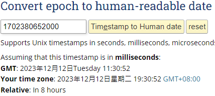

### 問題

資料庫使用 +8 的時間寫入無時區的資料欄位，透過 Debezium CDC 送到 kafka 後，會直接把該時間轉成 timestamp 格式，但卻不是使用 UTC+0 的時間記錄。

<!--more-->
寫入資料如下， `OPERATION_DATE` 欄位的資料為 `DATE`，以 UTC+8 時間直接紀錄。

經由 Debezium Kafka Connector 蒐集 CDC 資訊後，寫入到 Kafka 的資料如下，會將時間轉成 timestamp 的形式。

因為 epoch 通常是指 UTC+0 的標準時間，所以如果將 `1702380652000` 換成 date string 發現到該 timestamp 是 +8 後的時間。

### 解決方法

目前在 kafka connector 中找不到設定項可以轉換。所以需要透過其他 streaming process engine 處理，例如 flink 或 KSQLDB。