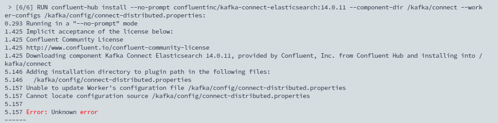

## TL; DR

因為在實作 kafka connect 時，常常會需要用到來自於 Confluent 以及 Debezium 兩個開源的 connect 鏡像，但每次都要根據當下需求而部署不同 image 的 container，故就打算將兩個 image 整合。

<!-- more -->

## Dockerfile

這個 image 整合了以下 Library：
- Oracle JDBC Driver for Debezium
- Kafka Connect JDBC for Debezium
- ConluentHub ElasticSearch sink
- ConfluentHub MongoDB source and sink

```docker
FROM debezium/connect:2.4

ENV KAFKA_CONNECT_JDBC_DIR=$KAFKA_CONNECT_PLUGINS_DIR/kafka-connect-jdbc \
    KAFKA_JDBC_VERSION=10.7.4 \
    POSTGRES_VERSION=42.6.0 \
  	ES_SINK_VERSION=14.0.11 \
	  MONGO_SOSI_VERSION=1.11.0

### Deploy Oracle JDBC Driver
ENV MAVEN_DEP_DESTINATION=$KAFKA_HOME/libs \
    ORACLE_JDBC_REPO=com/oracle/database/jdbc \
    ORACLE_JDBC_GROUP=ojdbc8 \
    ORACLE_JDBC_VERSION=21.6.0.0 \
    ORACLE_JDBC_MD5=312e6f4ec9932bbf74a4461669970c4b

RUN docker-maven-download central "$ORACLE_JDBC_REPO" "$ORACLE_JDBC_GROUP" "$ORACLE_JDBC_VERSION" "$ORACLE_JDBC_MD5"

### Deploy PostgreSQL JDBC Driver
RUN cd /kafka/libs && curl -sO https://jdbc.postgresql.org/download/postgresql-$POSTGRES_VERSION.jar

### Deploy Kafka Connect JDBC
RUN mkdir $KAFKA_CONNECT_JDBC_DIR && cd $KAFKA_CONNECT_JDBC_DIR &&\
        curl -sO https://packages.confluent.io/maven/io/confluent/kafka-connect-jdbc/$KAFKA_JDBC_VERSION/kafka-connect-jdbc-$KAFKA_JDBC_VERSION.jar

### Install Confluent Hub Client
ENV PATH=/kafka/confluent-hub-client/bin:$PATH

RUN mkdir -p $KAFKA_HOME/confluent-hub-client && cd $KAFKA_HOME/confluent-hub-client &&\
    curl -L -O http://client.hub.confluent.io/confluent-hub-client-latest.tar.gz &&\
    tar zxvf confluent-hub-client-latest.tar.gz -C $KAFKA_HOME/confluent-hub-client &&\
    rm -f confluent-hub-client-latest.tar.gz

COPY --chmod=777 for-confluent-hub-install.properties $KAFKA_HOME/config/for-confluent-hub-install.properties

### Install ElasticSearch sink
RUN confluent-hub install --no-prompt confluentinc/kafka-connect-elasticsearch:$ES_SINK_VERSION --component-dir $KAFKA_CONNECT_PLUGINS_DIR --worker-configs $KAFKA_HOME/config/for-confluent-hub-install.properties

### Install MongoDB source and sink
RUN confluent-hub install --no-prompt mongodb/kafka-connect-mongodb:$MONGO_SOSI_VERSION --component-dir $KAFKA_CONNECT_PLUGINS_DIR --worker-configs $KAFKA_HOME/config/for-confluent-hub-install.properties

USER kafka
```

## 坑

其中使用 confluent-hub install command 安裝時，需要指定 `--component-dir` 安裝 plugin 到指定目錄，以及 `worker-configs` 此為指定 connect properties 的參數檔，會幫忙更新參數檔中的 `plugin.path` 的值。

本來使用預設的配置檔 `/kafka/config/connect-distributed.properties`，但在 build 的時候會有 `unknown error` 。



為了解決這個問題，就寫了一個假的 properties 給他更新。反正 debezium connect image 預設還是會使用 `/kafka/config/connect-distributed.properties` 跑。只要確保 confluent 安裝的 library `--component-dir` 是安裝在配置檔指定的 `/kafka/connect` 下即可。