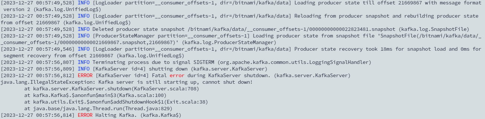

## TL; DR

在一次因斷電而 Kubernetes 集群重啟後，Kafka Cluster 無法自動重啟，會有以下錯誤訊息：

<!--more-->



## Reason

會因為啟動時間太長超過 statefulset 設定的 initialDelaySeconds 的時間，導致 k8s 發送 SYSTERM 訊號給 Pod 而 CrashLoopBackOff。
啟動 kafka broker 的時候，會重新加載每個 topic 的數據，正常情況下會提示每個 topic 恢復完成，如下範例。

```toml
[2023-12-27 01:24:45,995] INFO [LogLoader partition=99-alertmanager-6, dir=/bitnami/kafka/data] Recovering unflushed segment 52. 0/1 recovered for 99-alertmanager-6. (kafka.log.LogLoader) 
[2023-12-27 01:24:45,995] INFO [LogLoader partition=99-alertmanager-6, dir=/bitnami/kafka/data] Loading producer state till offset 52 with message format version 2 (kafka.log.UnifiedLog$) 
[2023-12-27 01:24:45,995] INFO [LogLoader partition=99-alertmanager-6, dir=/bitnami/kafka/data] Reloading from producer snapshot and rebuilding producer state from offset 52 (kafka.log.UnifiedLog$) 
[2023-12-27 01:24:46,104] INFO [ProducerStateManager partition=99-alertmanager-6] Wrote producer snapshot at offset 52 with 0 producer ids in 109 ms. (kafka.log.ProducerStateManager) 
[2023-12-27 01:24:46,104] INFO [LogLoader partition=99-alertmanager-6, dir=/bitnami/kafka/data] Producer state recovery took 0ms for snapshot load and 109ms for segment recovery from offset 52 (kafka.log.UnifiedLog$) 
[2023-12-27 01:24:46,136] INFO [LogLoader partition=99-alertmanager-6, dir=/bitnami/kafka/data] Loading producer state till offset 52 with message format version 2 (kafka.log.UnifiedLog$) 
[2023-12-27 01:24:46,136] INFO [LogLoader partition=99-alertmanager-6, dir=/bitnami/kafka/data] Reloading from producer snapshot and rebuilding producer state from offset 52 (kafka.log.UnifiedLog$) 
[2023-12-27 01:24:46,136] INFO Deleted producer state snapshot /bitnami/kafka/data/99-alertmanager-6/00000000000000000052.snapshot (kafka.log.SnapshotFile) 
[2023-12-27 01:24:46,136] INFO [LogLoader partition=99-alertmanager-6, dir=/bitnami/kafka/data] Producer state recovery took 0ms for snapshot load and 0ms for segment recovery from offset 52 (kafka.log.UnifiedLog$) 
[2023-12-27 01:24:46,156] INFO Completed load of Log(dir=/bitnami/kafka/data/99-alertmanager-6, topicId=GhYHO3u3QCWBkh_YmtCs8Q, topic=99-alertmanager, partition=6, highWatermark=52, lastStableOffset=52, logStartOffset=52, logEndOffset=52) with 1 segments in 186ms (45/84 completed in /bitnami/kafka/data) (kafka.log.LogManager)
```

## Solution

修改 statefulset 的 timeout 時間將 `initialDelaySeconds` 從原本的十秒改成半小時！