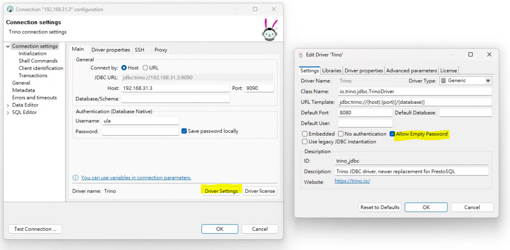
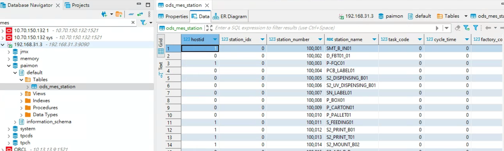

### TL; DR
Paimon 是一個 Data Lakehouse，其前身是 Flink 的 Table Store， 2023 年 3 月單獨孵化成一個 Apache 項目，並且還整合了其他 engine 如 Spark，完美跟 Flink 解耦。本篇記錄透過 Docker 安裝 Trino，並連接使用 S3 當作 filesystem 的 Apache Paimon，進行資料讀取。

<!--more-->

### 環境
- Apache Flink 1.17.2
- Apache Paimon 0.7
- Apache Trino 427

### 安裝

```
mkdir trino && cd trino
```

下載 trino-paimon 所需的 jar 檔，請參考官網提供的連結。

```sh
wget https://repository.apache.org/content/groups/snapshots/org/apache/paimon/paimon-trino-427/0.8-SNAPSHOT/paimon-trino-427-0.8-20240322.000522-8-plugin.tar.gz
tar -zxvf paimon-trino-427-0.8-20240322.000522-8-plugin.tar.gz && rm -f paimon-trino-427-0.8-20240322.000522-8-plugin.tar.gz
mv paimon/ trino_paimon_jars/
```

準備 `paimon.properties` 檔案

```
connector.name=paimon
warehouse=s3://ula-test/paimon
s3.endpoint=http://ceph-rgw.sdsp-stg.com:8080
fs.native-s3.enabled=true
s3.path-style-access=true
s3.sse.type=S3
s3.aws-access-key=0V2QOGVWCZAAK9DXA07P
s3.aws-secret-key=60Kwr0A9jjH4A2ZOHgY74ZBUbpxgG2ALsoQ6uC4W
s3.region=us-east-1
```

{}
這個設定檔是參考 trino <a href="https://trino.io/docs/current/object-storage/file-system-s3.html">官網</a> 的設定項，其中 Ceph 因為沒有 region，但該連接參數又是必須，所以隨意給一個地區字串。
{}

準備 `docker-compose.yaml` 檔案

```yaml
version: '3'
services:
  trino:
    container_name: trino
    image: trinodb/trino:427
    ports:
      - '9090:8080'
    user: trino
    environment:
      AWS_ACCESS_KEY: 0V2QOGVWCZAAK9DXA07P
      AWS_SECRET_KEY: 60Kwr0A9jjH4A2ZOHgY74ZBUbpxgG2ALsoQ6uC4W
    volumes:
      - ./trino_paimon_jars:/usr/lib/trino/plugin/paimon
      - ./paimon.properties/:/etc/trino/catalog/paimon.properties
      - ./tmp:/tmp
    networks:
      - flink-network

networks:
  flink-network:
    external: true
    name: flink-network
```

啟動

```
docker compose up -d
```

### 連接
可以透過 DBeaver 連線至 Trino 可視化查看所有表的資料，超方便！在連線時需要將 driver 設定成不需密碼驗證，隨意使用一個 username 便能登入。



查看表格




