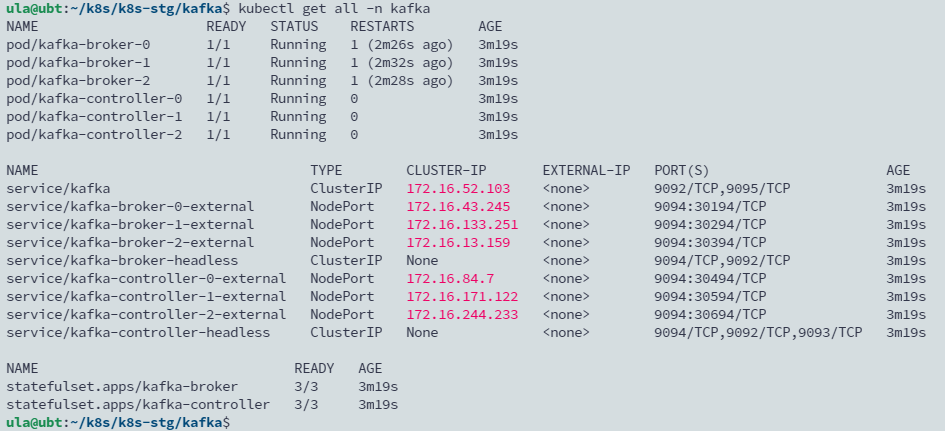

## TL; DR
本篇文章記錄使用 bitnami helm chart 安裝 kafka Kraft mode 的對外集群。

<!--more-->

## 準備 values.yaml 文件

```yaml
global:
  storageClass: ceph-csi-rbd-hdd 

heapOpts: "-Xmx6g -Xms6g"

listeners:
  interbroker:
    name: INTERNAL
    containerPort: 9092
    protocol: PLAINTEXT
  controller:
    name: CONTROLLER
    containerPort: 9093
    protocol: PLAINTEXT
  client:
    name: CLIENT
    containerPort: 9095
    protocol: PLAINTEXT
  external:
    containerPort: 9094
    protocol: PLAINTEXT
    name: EXTERNAL

controller:
  replicaCount: 3
  persistence:
    size: 50Gi

broker:
  replicaCount: 3
  persistence:
    size: 300Gi

externalAccess:
  enabled: true
  controller:
    forceExpose: false
    service:
      type: NodePort
      ports:
        external: 9094
      nodePorts:
        - 30494
        - 30594
        - 30694
      useHostIPs: true
  broker:
    service:
      type: NodePort
      ports:
        external: 9094
      nodePorts:
        - 30194
        - 30294
        - 30394
      useHostIPs: true

volumePermissions:
  enabled: true

rbac:
  create: true

kraft:
  clusterId: M2VhY2Q3NGQ0NGYzNDg2YW
```

## 部署

```yaml
helm upgrade --install -name kafka bitnami/kafka --namespace kafka -f values.yaml
```


```yaml
Kafka can be accessed by consumers via port 9095 on the following DNS name from within your cluster:

    kafka.kafka.svc.cluster.local

Each Kafka broker can be accessed by producers via port 9095 on the following DNS name(s) from within your cluster:

    kafka-controller-0.kafka-controller-headless.kafka.svc.cluster.local:9095
    kafka-controller-1.kafka-controller-headless.kafka.svc.cluster.local:9095
    kafka-controller-2.kafka-controller-headless.kafka.svc.cluster.local:9095
    kafka-broker-0.kafka-broker-headless.kafka.svc.cluster.local:9095
    kafka-broker-1.kafka-broker-headless.kafka.svc.cluster.local:9095
    kafka-broker-2.kafka-broker-headless.kafka.svc.cluster.local:9095
```

## 為 Kafka 設定 Load Balance

部署完畢後可以看到每個 broker / controller 皆使用 NodePort 對外開放，可以為 kafka 設定 Load Balance 以提供外部存取的 client 透過統一的入口點存取。



目前 Kubernetes 外部已經為集群建立一個 Nginx，我們可以直接使用這台 server 也為 Kafka 的 TCP 流量設置負載轉發。其設定檔如下，將所有會被開到 Node Port 的 Worker Node 節點一次設置上去：

```toml
upstream tcp9094 {
    server 172.20.37.36:30194 max_fails=3 fail_timeout=30s;
    server 172.20.37.36:30294 max_fails=3 fail_timeout=30s;  
    server 172.20.37.36:30394 max_fails=3 fail_timeout=30s;
    server 172.20.37.36:30494 max_fails=3 fail_timeout=30s;
    server 172.20.37.36:30594 max_fails=3 fail_timeout=30s;  
    server 172.20.37.36:30694 max_fails=3 fail_timeout=30s;
 
    server 172.20.37.37:30194 max_fails=3 fail_timeout=30s;
    server 172.20.37.37:30294 max_fails=3 fail_timeout=30s;
    server 172.20.37.37:30394 max_fails=3 fail_timeout=30s;
    server 172.20.37.37:30494 max_fails=3 fail_timeout=30s;
    server 172.20.37.37:30594 max_fails=3 fail_timeout=30s;
    server 172.20.37.37:30694 max_fails=3 fail_timeout=30s;

    server 172.20.37.38:30194 max_fails=3 fail_timeout=30s;
    server 172.20.37.38:30294 max_fails=3 fail_timeout=30s;
    server 172.20.37.38:30394 max_fails=3 fail_timeout=30s;
    server 172.20.37.38:30494 max_fails=3 fail_timeout=30s;
    server 172.20.37.38:30594 max_fails=3 fail_timeout=30s;
    server 172.20.37.38:30694 max_fails=3 fail_timeout=30s;

    server 172.20.37.39:30194 max_fails=3 fail_timeout=30s;
    server 172.20.37.39:30294 max_fails=3 fail_timeout=30s;
    server 172.20.37.39:30394 max_fails=3 fail_timeout=30s;
    server 172.20.37.39:30494 max_fails=3 fail_timeout=30s;
    server 172.20.37.39:30594 max_fails=3 fail_timeout=30s;
    server 172.20.37.39:30694 max_fails=3 fail_timeout=30s;

    server 172.20.37.40:30194 max_fails=3 fail_timeout=30s;
    server 172.20.37.40:30294 max_fails=3 fail_timeout=30s;
    server 172.20.37.40:30394 max_fails=3 fail_timeout=30s;
    server 172.20.37.40:30494 max_fails=3 fail_timeout=30s;
    server 172.20.37.40:30594 max_fails=3 fail_timeout=30s;
    server 172.20.37.40:30694 max_fails=3 fail_timeout=30s;
 
    server 172.20.37.41:30194 max_fails=3 fail_timeout=30s;
    server 172.20.37.41:30294 max_fails=3 fail_timeout=30s;
    server 172.20.37.41:30394 max_fails=3 fail_timeout=30s;
    server 172.20.37.41:30494 max_fails=3 fail_timeout=30s;
    server 172.20.37.41:30594 max_fails=3 fail_timeout=30s;
    server 172.20.37.41:30694 max_fails=3 fail_timeout=30s;  

    server 172.20.37.42:30194 max_fails=3 fail_timeout=30s;
    server 172.20.37.42:30294 max_fails=3 fail_timeout=30s;
    server 172.20.37.42:30394 max_fails=3 fail_timeout=30s;
    server 172.20.37.42:30494 max_fails=3 fail_timeout=30s;
    server 172.20.37.42:30594 max_fails=3 fail_timeout=30s;
    server 172.20.37.42:30694 max_fails=3 fail_timeout=30s;
}

server {
    listen        9094;
    proxy_pass    tcp9094;
 
    proxy_connect_timeout 300s;
    proxy_timeout 300s;
}
```

## 部署 Kafka UI

```yaml
yamlApplicationConfig:
  kafka:
    clusters:
      - name: platform
        bootstrapServers:  kafka-broker-headless:9092
  auth:
    type: disabled
  management:
    health:
      ldap:
        enabled: false
```

```yaml
helm install -name kafka-ui kafka-ui/kafka-ui -f values.yaml --namespace kafka
```

