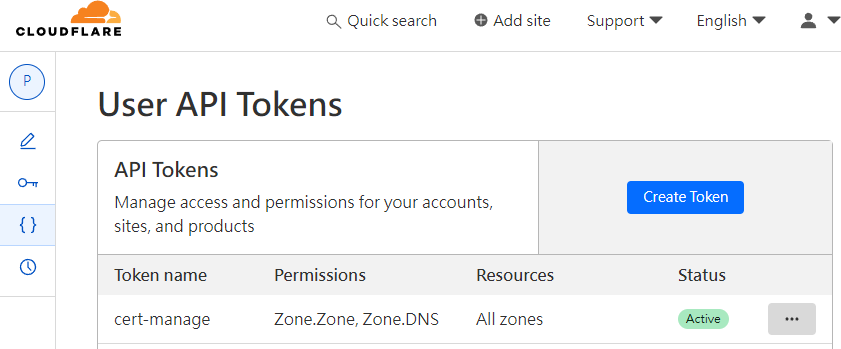
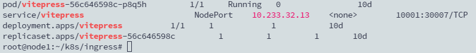
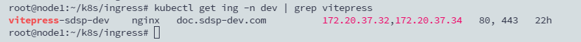
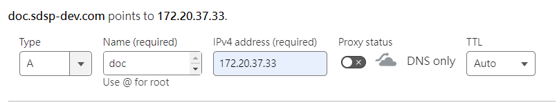
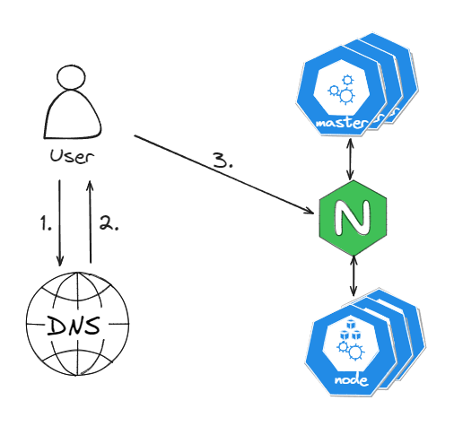

## TL; DR
紀錄使用 Helm Chart 安裝 Ingress Nginx Controller 以及 Cert Manager 並設置 TLS 憑證的過程。

<!--more-->

## Ingress Nginx Controller

### 準備 helm chart

```bash
helm repo add ingress-nginx https://kubernetes.github.io/ingress-nginx
helm repo update
helm pull ingress-nginx/ingress-nginx
tar -zxvf ingress-nginx-xxx.tgz
cd ingress-nginx
```

### 編輯 values.yaml 設定

- kind 類型更改為：DaemonSet

```yaml
 # -- Use a `DaemonSet` or `Deployment`
  kind: DaemonSet
  # -- Annotations to be added to the controller Deployment or DaemonSet
```

- service template 的 type 改為 NodePort

```yaml
  service:
    # -- Enable controller services or not. This does not influence the creation of either the admission webhook or the metrics service.
    enabled: true
    external:
      # -- Enable the external controller service or not. Useful for internal-only deployments.
      enabled: true
    # -- Annotations to be added to the external controller service. See `controller.service.internal.annotations` for annotations to be added to the internal controller service.
    annotations: {}
    # -- Labels to be added to both controller services.
    labels: {}
    # -- Type of the external controller service.
    # Ref: https://kubernetes.io/docs/concepts/services-networking/service/#publishing-services-service-types
    type: NodePort
```

### 安裝

```yaml
helm install ingress-nginx --namespace ingress-nginx --create-namespace
```

## Cert Manager

### 準備 helm chart 及安裝

```yaml
helm repo add jetstack https://charts.jetstack.io
helm repo update
helm install cert-manager jetstack/cert-manager \
  --namespace cert-manager \
  --create-namespace \
  --set installCRDs=true
```

### 取得 Cloudflare API Token

將 API Token 的 Permission 設為 `Zone.Zone, Zone.DNS` ；Resources 設為 `All zones`。



### 建立 Cluster Issuer

```yaml
apiVersion: v1
kind: Secret
metadata:
  name: cloudflare-api-token
  namespace: cert-manager
type: Opaque
stringData:
  api-token: uNlI5Slnd-NqqyUX9iNoVlJ2jh57kFAzT5DxKE2E
---
apiVersion: cert-manager.io/v1
kind: ClusterIssuer
metadata:
  name: letsencrypt-prd
  namespace: cert-manager
spec:
  acme:
    email: asus.sdsp@gmail.com
    server: https://acme-v02.api.letsencrypt.org/directory
    privateKeySecretRef:
      name: letsencrypt-prd
    solvers:
    - selector:
        dnsZones:
          - "sdsp-dev.com"
          - "*.sdsp-dev.com"
      dns01:
        cloudflare:
          email: asus.sdsp@gmail.com
          apiTokenSecretRef:
            name: cloudflare-api-token
            key: api-token
```

### 建立 wildcard 憑證

```yaml
apiVersion: cert-manager.io/v1
kind: Certificate
metadata:
  name: wildcard-sdsp-dev-prd
  namespace: cert-manager
spec:
  dnsNames:
    - "sdsp-dev.com"
    - "*.sdsp-dev.com"
  issuerRef:
    kind: ClusterIssuer
    name: letsencrypt-prd
  secretName: wildcard-sdsp-dev-prd
```

### 更改 ingress-nginx-controller 的 default ssl cert

```yaml
kubectl edit daemonset.apps/ingress-nginx-controller -n ingress-nginx
```

在 containers 下的 `args` 加上上面 cert-manager 中創建的 ca

```yaml
- --default-ssl-certificate=cert-manager/wildcard-sdsp-dev-prd
```

## 測試

### 建立服務的 ingress 資源

假設環境下已有一個 deployment 資源 vitepress



為 vitepress service 建立 ingress 資源，以供對外存取。

```yaml
apiVersion: networking.k8s.io/v1
kind: Ingress
metadata:
  labels:
    app.kubernetes.io/name: vitepress
  name: vitepress-sdsp-dev
  namespace: dev
  annotations:
    nginx.ingress.kubernetes.io/use-regex: "true"
spec:
  ingressClassName: nginx
  tls:
  - hosts:
    - doc.sdsp-dev.com
  rules:
  - host: doc.sdsp-dev.com
    http:
      paths:
      - backend:
          service:
            name: vitepress
            port:
              number: 80
        path: /.*
        pathType: Prefix
```



並在 Cloudflare 設定 DNS A Record 即可，因為在 Kubernetes 集群前面放了一個 Nginx 做負載均衡，所以可以直接將 Cloudflare DNS Record 的 IP Address 設為 `172.20.37.33`。



## 補充 Kubernetes + Nginx HA 架構圖





其他常見的 HA 架構為使用 HA Proxy + keepalive


