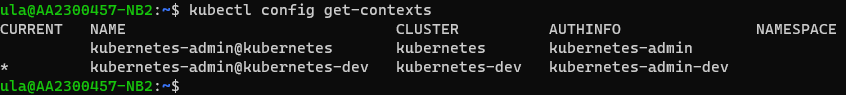

### 安裝 kubectl

可直接參考[官網](https://kubernetes.io/docs/tasks/tools/install-kubectl-linux/)，依照環境選擇想要的安裝方法安裝。

<!--more-->

### 準備 config 檔案

將兩座 k8s config，存在任意目錄下

```bash
$ mkdir k8s-config
$ vi dev
$ vi stg
```

### 將多個 config 合併

```bash
$ export KUBECONFIG=~/k8s-config/dev:~/k8s-config/stg
$ kubectl config view --flatten
```

將指令返回的 config 複製到 kubernetes 的預設 config 目錄 `.kube` 下

```bash
$ vi ~/.kube/config
```

並重新修改環境變數

```bash
$ export KUBECONFIG=~/.kube/config
```

### 成功使用

就能直接透過 `kubectl config` 指令管理 context 了

```bash
$ kubectl config get-contexts
```



切換存取 Kubernets 叢集

```bash
$ kubectl config use-context kubernetes-admin@kubernetes-dev
```



其實 config 並不一定要合在一起，分開然後使用環境變數指定多個 config 也可以。看自己的習慣~


