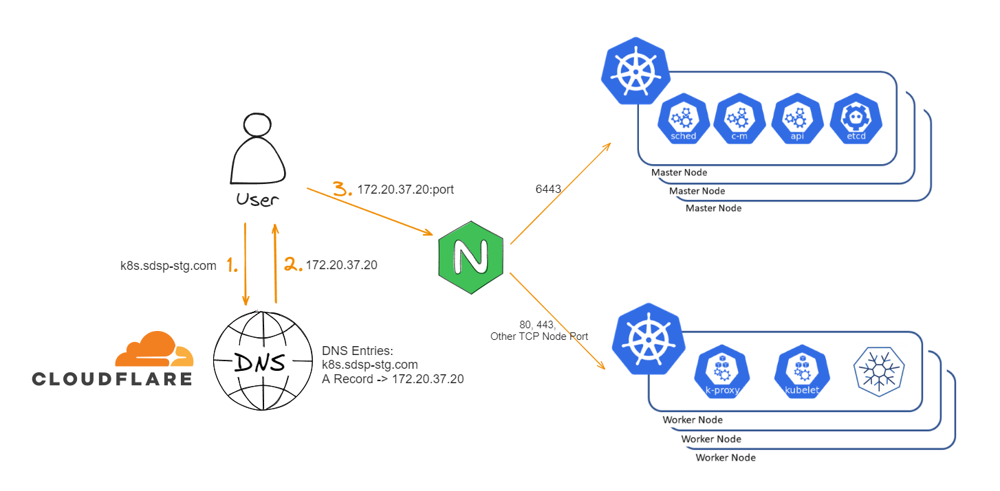
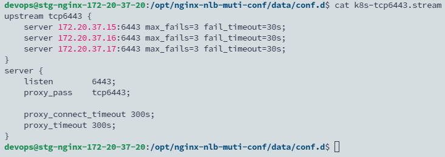

## TL; DR
目前的 Kubernetes HA 架構是使用 Nginx 當 Loadbalancer，所以在使用 Kubespray 部署時可以設定 api server 的 endpoint 為 external LB。

<!--more-->



[inventory/sample/group_vars/all/all.yml](https://github.com/kubernetes-sigs/kubespray/blob/master/inventory/sample/group_vars/all/all.yml)

```yaml
## External LB example config
## apiserver_loadbalancer_domain_name: "elb.some.domain"
# loadbalancer_apiserver:
#   address: 1.2.3.4
#   port: 1234
```

!!! 所以在部署 ansible playbook 前需要多修改 group_vars

```bash
vi inventory/mycluster/group_vars/all/all.yml
```

將上面的 External LB example config 拿掉註解，並設定

```bash
apiserver_loadbalancer_domain_name: "k8s.sdsp-dev.com"
# 設定 nginx IP 以及轉發的 port
loadbalancer_apiserver:
   address: 172.20.37.19
   port: 6443
```

補充 nginx 的 stream config



## Reference

- https://www.youtube.com/watch?v=u_1f3WyvtQE