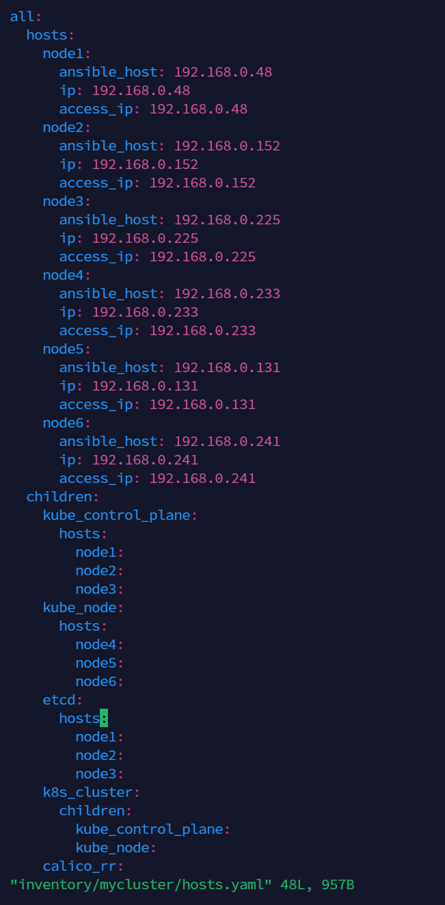
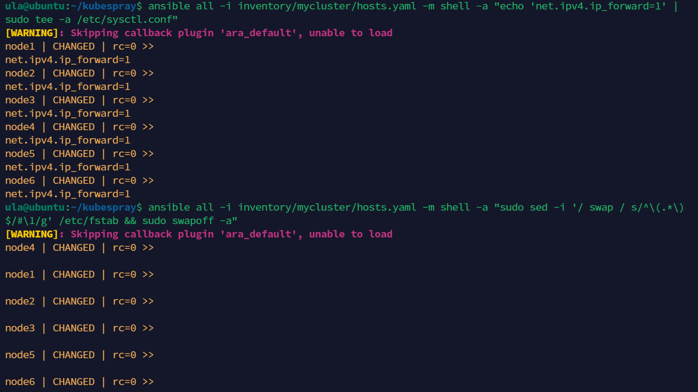
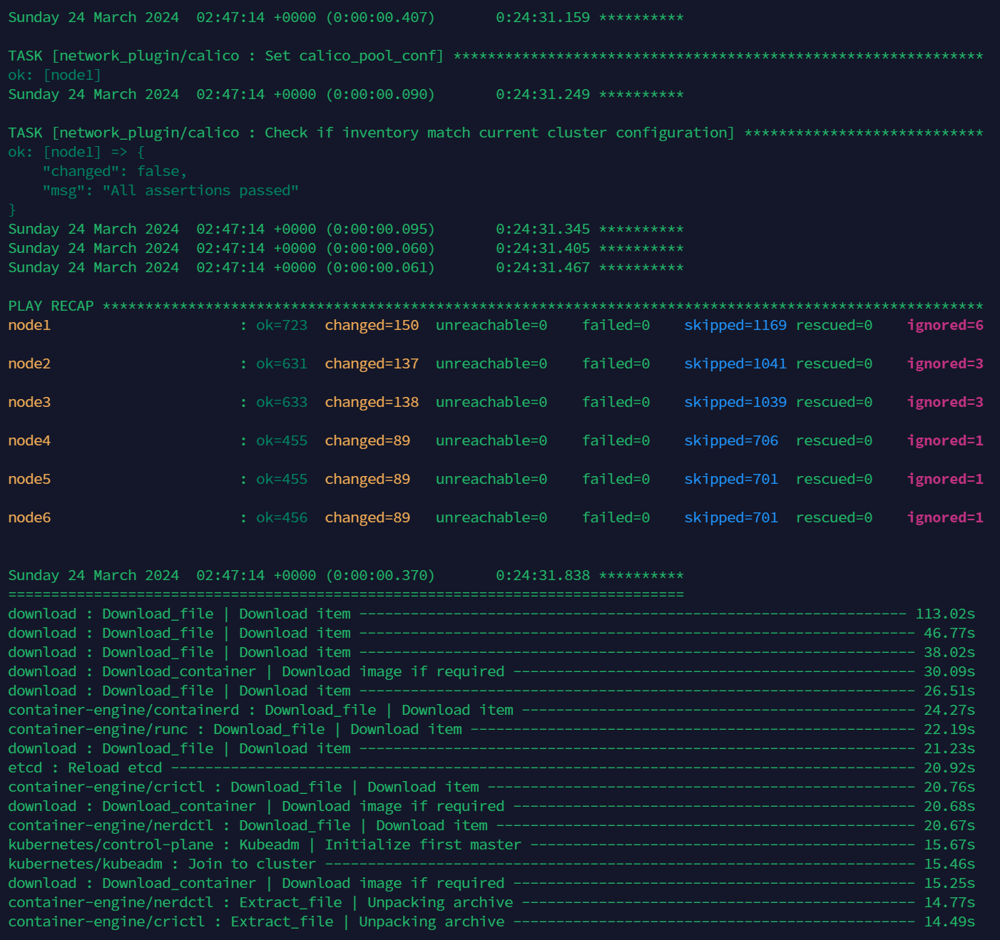
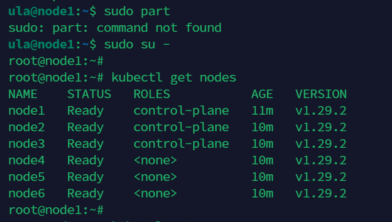

### TL; DR
紀錄使用 Kubespray 透過 Ansible 快速部署 Kubernetes 集群。
<!--more-->

### 環境
#### Ansible 控制節點
- Ubuntu 22.04 LTS
- 2 CPU
- 4GB RAM
- 20GB Disk

#### 3 個 master 節點
- Ubuntu 22.04 LTS
- 2 CPU
- 4GB RAM
- 20GB Disk

#### 3 個 worker 節點
- Ubuntu 22.04 LTS
- 4 CPU
- 8GB RAM
- 80GB Disk

#### Kubespray 最低要求
- Ansible 節點：1024 MB、1 個 CPU 與 20 GB 磁碟空間
- Master：1500 MB RAM、2 個 CPU 和 20 GB 可用磁碟空間
- Worker：1024 MB、2 個 CPU、20 GB 可用磁碟空間
- 每個節點上的互聯網連接
- 擁有 sudo 管理員權限

### 配置 Ansible 控制節點

#### 安裝所需套件

```sh
sudo apt update
sudo apt install git python3-pip -y
git clone https://github.com/kubernetes-incubator/kubespray.git
cd kubespray
sudo pip install -r requirements.txt
```

#### 複製執行 ssh 金鑰

```sh
ssh-keygen # 如果在 ~/.ssh/ 下沒有金鑰創建的話
ssh-copy-id ula@192.168.0.48
ssh-copy-id ula@192.168.0.152
ssh-copy-id ula@192.168.0.225
ssh-copy-id ula@192.168.0.233
ssh-copy-id ula@192.168.0.131
ssh-copy-id ula@192.168.0.241
```

#### 準備 Ansible Host 清單

```sh
cp -rfp inventory/sample inventory/mycluster
declare -a IPS=(192.168.0.48 192.168.0.152 192.168.0.225 192.168.0.233 192.168.0.131 192.168.0.241)CONFIG_FILE=inventory/mycluster/hosts.yaml python3 contrib/inventory_builder/inventory.py ${IPS[@]}
```
修改清單，設置 master node 及 worker node 各 3 個
```sh
vi inventory/mycluster/hosts.yaml
```


#### 修改 K8s 部署變數

```sh
vi inventory/mycluster/group_vars/k8s_cluster/k8s-cluster.yml
```
主要修改以下選項：
```yaml
kube_version: v1.29.2
kube_network_plugin: calico # default
kube_pods_subnet: 10.233.64.0/18 # default
kube_service_addresses: 10.233.0.0/18 # default
```

#### 修改安裝套件
```sh
vi inventory/mycluster/group_vars/k8s_cluster/addons.yml
```
主要開啟以下功能
```yaml
helm_enabled: true
dashboard_enabled: true
ingress_nginx_enabled: true
ingress_nginx_host_network: true
```

### 配置 Ansible 遠端節點

設定要 ssh 遠端執行的帳號免密碼使用 sudo
```sh
echo "ula ALL=(ALL) NOPASSWD:ALL" | sudo tee /etc/sudoers.d/ula
```

### k8s 事前環境設定
回到 Ansible 控制節點，透過遠端執行一次處理 Kubernetes 安裝前的環境基本設定。
```sh
cd kubespray

# 禁用防火牆
ansible all -i inventory/mycluster/hosts.yaml -m shell -a "sudo systemctl stop firewalld && sudo systemctl disable firewalld"

# 禁用 IPv4 轉發
ansible all -i inventory/mycluster/hosts.yaml -m shell -a "echo 'net.ipv4.ip_forward=1' | sudo tee -a /etc/sysctl.conf"

# 禁用 swap
ansible all -i inventory/mycluster/hosts.yaml -m shell -a "sudo sed -i '/ swap / s/^\(.*\)$/#\1/g' /etc/fstab && sudo swapoff -a"
```


### 開始部署
```sh
ansible-playbook -i inventory/mycluster/hosts.yaml --become --become-user=root cluster.yml
```
完成後查看執行結果是否成功。


### 操作集群
登入第一個 master node，切換到 root，就可以透過 kubectl 命令操作集群了!
```sh
sudo su -
kubectl get nodes
```


### Reference
- https://linux.cn/article-15675-1.html