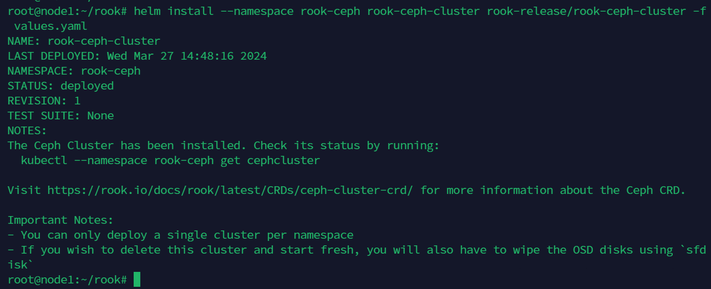
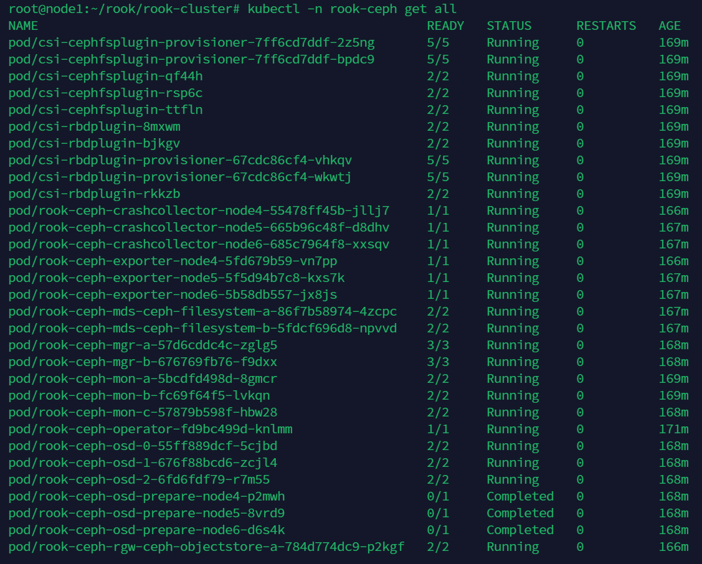

### TL; DR
使用 Rook Helm Chart 在 Kubernetes 上安裝 Rook Operator 以及 Ceph 集群，並透過 CSI 使用 PVC。
<!--more-->

### Prerequisites

- Kubernetes：支持 v1.25 至 v1.29 版本
- Ceph Node Resource Requiement：不同組件需要不同的硬體資源大小，請參考 [SUSE 文檔](https://documentation.suse.com/sbp/storage/html/SBP-rook-ceph-kubernetes/index.html#sec-hardware-resource-req) 了解具體要求。


測試發現，三個工作節點配置為 4 core vCPU / 8GB RAM 會導致安裝失敗，升級至 8 core vCPU / 16GB RAM 後才能順利運行。


- 至少需要以下一種本地儲存類型：
    - 原始硬碟（無分區或格式化文件系統）
    - 原始硬碟分區（無格式化文件系統）
    - LVM 邏輯卷（無格式化文件系統）
    - 在已存在的 Storage Class 中，以 block level 型態提供的 Persistent Volumes
- RBD：
    
    Ceph 需要使用具有 RBD 模組的 Linux kernel。許多 Linux 發行版都已經包含了 RBD 模組，但不是所有的發行版都有，使用下面 command 確認及載入
    
    ```bash
    lsmod | grep rbd
    
    # 若無返回，則執行下面載入
    sudo modprobe rbd
    sudo vim  /etc/modules-load.d/rbd.conf	# 文件名任意，以.conf 結尾即可
    rbd		#内容寫 rbd 即可
    ```

### Installation Step

整體流程如下

- 安裝 Rook Operator
- 部署 Ceph 叢集
- 驗證 Ceph 集群
- 使用 Ceph 存儲

#### Install Rook Operator

```bash
helm repo add rook-release https://charts.rook.io/release
helm install --create-namespace --namespace rook-ceph rook-ceph rook-release/rook-ceph
```



如果叢集是一個三節點的叢集（1 個 Master + 2 個 Worker），那麼 Master 節點也需要作為工作負載節點使用，可以去掉欲安裝的 master 節點的污點：


```bash
kubectl taint node node1 node-role.kubernetes.io/master:PreferNoSchedule-
```

#### Install Rook Cluster

準備 values.yaml

```yaml
operatorNamespace: rook-ceph
cephClusterSpec:
  dashboard:
    enabled: true
    ssl: false
```

安裝 cluster

```bash
helm install --namespace rook-ceph rook-ceph-cluster rook-release/rook-ceph-cluster -f values.yaml
```



#### Verify the Ceph Cluster Installation

```bash
kubectl -n rook-ceph get cephcluster
```

當健康狀態返回 `HEALTH_OK` 


```bash
kubectl -n rook-ceph get all
```

且所有部屬元件皆正常 `Running` 後



便可直接進入下一步的佈署 pvc 資源測試

#### Deploy a Validation PVC and Pod

查看 StorageClass

```bash
kubectl get sc
```


使用 block level storage 宣告 PVC

```yaml
# pvc.yaml
apiVersion: v1
kind: PersistentVolumeClaim
metadata:
  name: my-pvc
  namespace: test
spec:
  accessModes:
    - ReadWriteOnce
  resources:
    requests:
      storage: 1Gi
  storageClassName: ceph-block
```

```yaml
kubectl apply -f pvc.yaml
```

當 STATUS 返回 `Bound` 就成功了。


### Completely Clean Rook

當安裝失敗要重新安裝時，需要執行以下步驟，才能重新安裝。

1. Uninstall all rook resource and delete the namespace
    
    ```bash
    helm uninstall rook-ceph-cluster -n rook-ceph

    # 測試後發現刪除 chart 之後不會刪除自動刪除相應資源，需額外刪除
    kubectl -n rook-ceph delete deployment.apps/rook-ceph-crashcollector-node4
    kubectl -n rook-ceph delete deployment.apps/rook-ceph-crashcollector-node5
    kubectl -n rook-ceph delete deployment.apps/rook-ceph-crashcollector-node6
    kubectl -n rook-ceph delete deployment.apps/rook-ceph-mgr-a
    kubectl -n rook-ceph delete deployment.apps/rook-ceph-mgr-b
    kubectl -n rook-ceph delete deployment.apps/rook-ceph-mon-b
    kubectl -n rook-ceph delete deployment.apps/rook-ceph-mon-a
    kubectl -n rook-ceph delete deployment.apps/rook-ceph-mon-c
    kubectl -n rook-ceph delete deployment.apps/rook-ceph-mds-ceph-filesystem-a
    kubectl -n rook-ceph delete deployment.apps/rook-ceph-mds-ceph-filesystem-b
    kubectl -n rook-ceph delete job.batch/rook-ceph-csi-detect-version
    kubectl -n rook-ceph delete job.batch/rook-ceph-osd-prepare-node4
    kubectl -n rook-ceph delete job.batch/rook-ceph-osd-prepare-node5
    kubectl -n rook-ceph delete job.batch/rook-ceph-osd-prepare-node6
    kubectl -n rook-ceph delete service/rook-ceph-exporter
    kubectl -n rook-ceph delete service/rook-ceph-mgr
    kubectl -n rook-ceph delete service/rook-ceph-mgr-dashboard
    kubectl -n rook-ceph delete service/rook-ceph-mon-a
    kubectl -n rook-ceph delete service/rook-ceph-mon-b
    kubectl -n rook-ceph delete service/rook-ceph-mon-c
    kubectl -n rook-ceph delete service/rook-ceph-rgw-ceph-objectstore
    
    # 除了 k8s 預設的資源外，還有以下的 CRD 資源須刪除
    kubectl -n rook-ceph delete cephobjectstore ceph-objectstore &
    kubectl -n rook-ceph delete cephfilesystem ceph-filesystem &
    kubectl -n rook-ceph delete cephblockpool ceph-blockpool &
    kubectl -n rook-ceph delete cephcluster rook-ceph &
    kubectl -n rook-ceph get cephobjectstores.ceph.rook.io ceph-objectstore -o json | jq '.metadata.finalizers = null' | kubectl -n rook-ceph apply -f -
    kubectl -n rook-ceph get cephblockpools.ceph.rook.io ceph-blockpool -o json | jq '.metadata.finalizers = null' | kubectl -n rook-ceph apply -f -
    kubectl -n rook-ceph get cephfilesystems.ceph.rook.io ceph-filesystem -o json | jq '.metadata.finalizers = null' | kubectl -n rook-ceph apply -f -
    kubectl -n rook-ceph get cephcluster.ceph.rook.io rook-ceph -o json | jq '.metadata.finalizers = null' | kubectl -n rook-ceph apply -f -
    
    # 移除 configmap
    kubectl -n rook-ceph patch configmap rook-ceph-mon-endpoints --type merge -p '{"metadata":{"finalizers": []}}'
    kubectl -n rook-ceph patch secrets rook-ceph-mon --type merge -p '{"metadata":{"finalizers": []}}'
    kubectl delete configmap -n rook-ceph rook-ceph-csi-config
    kubectl delete configmap -n rook-ceph rook-ceph-csi-mapping-config
    kubectl delete configmap -n rook-ceph rook-ceph-operator-config
    kubectl delete configmap -n rook-ceph rook-ceph-pdbstatemap

    # 移除 Operator
    helm uninstall rook-ceph -n rook-ceph

    # 移除 CRD
    for CRD in $(kubectl get crd -n rook-ceph | awk '/ceph.rook.io/ {print $1}'); do     kubectl get -n rook-ceph "$CRD" -o name |     xargs -I {} kubectl patch -n rook-ceph {} --type merge -p '{"metadata":{"finalizers": []}}'; done
    kubectl get crd | grep rook.io | awk '{print $1}' | xargs kubectl delete crd

    # 最終刪除 namespace
    kubectl delete ns rook-ceph
    ```
    
2. Clear Rook data from Ceph node and zap the storage devices
    
    假設存儲設備是 **`/dev/sdb`** 磁盤，需要刪除該設備所有數據。
    
    ```bash
    # remove data
    sudo rm -rvf /var/lib/rook
    
    # zapping devices
    DISK="/dev/sdb"
    sudo sgdisk --zap-all $DISK
    sudo dd if=/dev/zero of="$DISK" bs=1M count=100 oflag=direct,dsync
    # SSDs may be better cleaned with blkdiscard instead of dd
    sudo blkdiscard $DISK
    sudo partprobe $DISK
    ```