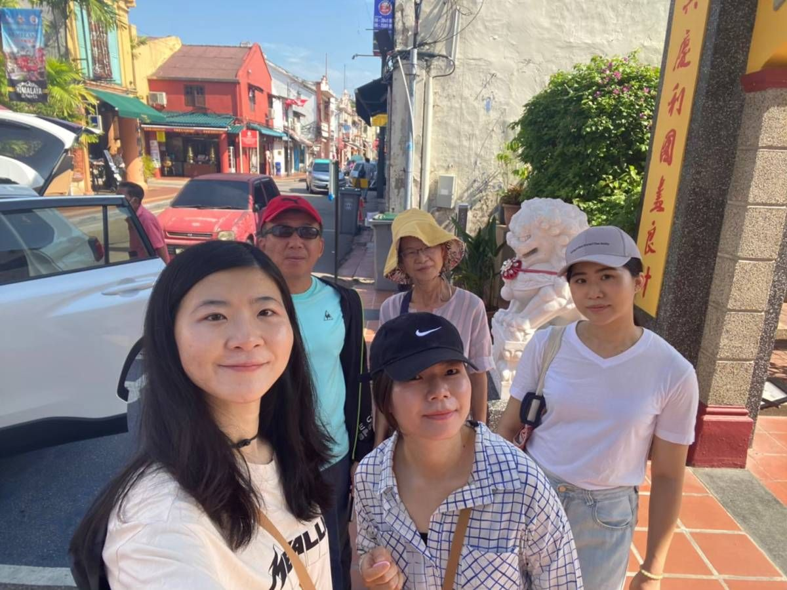
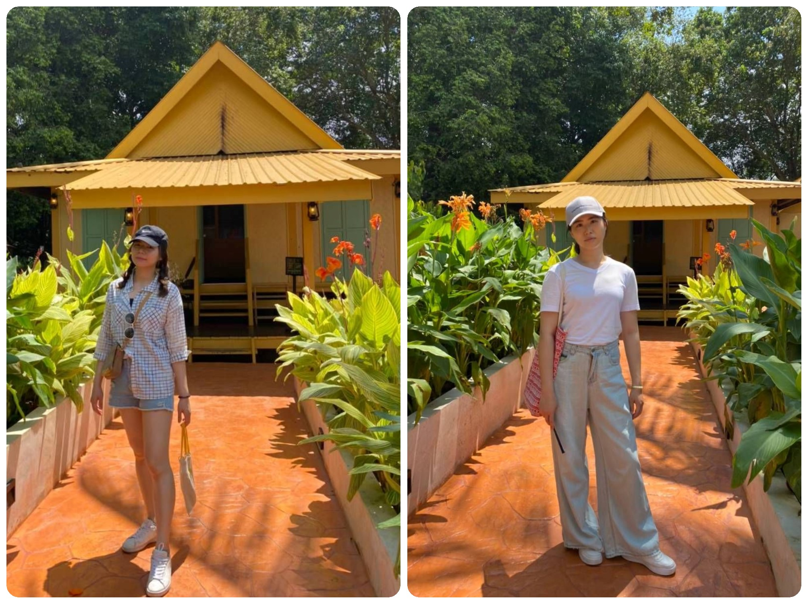
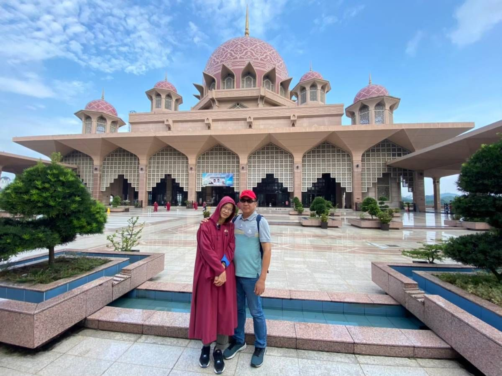

## TL; DR
因為疫情，距離上一次去沖繩居然已過了將近四年。Covid-19 從一開始的半信半疑到大爆發的人人恐慌，兩年多過去，人們開始與病毒共處。今年全球旅遊終於都開放啦! 而今年連假又特別多，年初一直有打算出國，甚至連日幣都趁貶值的時候換起來放了，拖到三月中才終於決定要在端午連假安排出國。但殊不知六月的日本根本不是適合去 XDD 3/12 臨時改變目的地，也從本來的自住行改成跟團旅遊，花了三天討論，最後找到一個剛好卡在連假又團費一個人不包含小費兩萬一超便宜的馬來西亞五天四夜遊。原本擔心的行程跟住宿品質，在去玩後沒想到都在期望值以上!

## 行前準備
馬幣在台灣屬於冷門貨幣，所以銀行賣出 7.多 買入 5.多 的匯率完全不划算，才發現大家如果要換馬幣都在當地換。幸好刷了兩天背包客棧，直接跟一個剛從馬來西亞回來的包友用匯率 7 換到 $2500 的馬幣，還可以在台北面交，面交完順便去東區逛街治裝 ٩(ˊᗜˋ*)و 另外也順利在出發前買好網卡，兩張 5 天 10 G 開熱點分享綽綽有餘!

## DAY 1 - 馬六甲

### 起飛
雖然是跟團，但早上六點半的班機也幾乎是紅眼班機了，拔麻姐他們一點半從嘉義出發。早上臨時決定叫車去，本來用大都會 app 媒合了一個上午未果，後來客服打來最後幸好有媒合到車 (。•́︿•̀。)，從淡水竹圍(馬上用了新公司的全薪事假請 (⑉¯ꇴ¯⑉) ) 回到中和還能收行李洗澡睡覺三點半出發～雖然太興奮了也是睡睡醒醒的 XD
一到機場去五樓跟拔麻姐會合在 711 吃早(宵?)餐(夜?)，連假的機場果然超熱鬧，一大清早就擠滿了要出國玩的人們，空氣都瀰漫著開心的氛圍! 四點半到集合地點會合，這團總共有 19 位團員~有四小分隊!
登機需要搭接駁車在機場中間上飛機，一上飛機就立馬補個眠，不過飛機餐馬上就送來了，吃了蕃茄海鮮麵，在看部電影，再去戴個隱形眼鏡梳妝打扮一下，四個半小時的飛程很快就到了!

### 休息站
因為從吉隆坡下飛機後到入境後大約 12 點，第一天的行程要直接開往麻六甲，兩個半小時的車程太久，當地導遊 (國外跟團原來除了領隊外，還會有當地導遊) 在路上先安插了一站休息站讓我們先充饑，在這裡吃了椰漿飯、蜂蜜吐司配生雞蛋、河粉、咖哩包、炸雞、美祿~ 隔壁還有熱情的印度人分享當地水果龍宮果。

### 荷蘭紅屋、聖保羅教堂
第一站到荷蘭殖民時所建設的荷蘭紅屋，望眼放去是清一色的紅色建築，有種來到淡水紅毛城的錯覺 XDD
 
接著莫名其妙地坐著羞恥的腳踏花車，邊大聲的播著蝦趴的音樂 (你是我的花朵之類的 XDDD) 羞恥的到達下一站聖保羅教堂。跟團就是會有這個莫名其妙但媽媽可能很喜歡的行程哈哈哈
 
聖保羅教堂遺址處，古城已然滄桑變遷，可以感受到歷史的厚重。
 
往上走到到制高點，可以眺望馬六甲的風景。

在這邊可以見證了馬六甲在葡萄牙、荷蘭、英國等殖民勢力之間的更迭。

### 海峽清真寺
接著來到建在人工島上的海峽清真寺，太陽映照下的景色很美。為了尊重當地的宗教習俗，女性進入清真寺僅能露出臉部，於是乎就體驗了首次的伊斯蘭服飾 🤣。
 

### 晚餐 & 飯店

晚餐吃馬六甲娘惹村的合菜，飯店住 ECO Tree，因為沒有三人房型，所以是雙人床再加一張行軍床，幸好行軍床很好睡 (`･∀･)b 晚上一家人走到附近的商場，然後在全家買了隻榴槤冰吃~!

 

## DAY 2 - 馬六甲

### 雞場街
一早來到馬六甲市中心的一條雞場街，買一些伴手禮，
 

 

觀光有故事的咖啡館，另外總是對這種涼茶沒什麼抗拒力
 

中途在一間體驗娘惹服的茶館吃了五顏六色的娘惹糕
 

還吃了榴槤泡芙 (各種榴槤 XDDD)，接著也在這邊享用午餐雞飯粒。
 

### Malaysia Heritage Studios
這個景點是以馬來西亞文化遺產為主題，園區內有13個州的馬來傳統房屋，每個房屋都意外的好拍 (❛◡❛✿)
 
 
 
 
 

但天氣實在是太熱了，大家都逛很快，變擠在入口的商店小屋吹冷氣，殊不知全玻璃的牆面一點涼感都沒有，所以我們一家在時間還沒結束前就上遊覽車吹冷氣了 (๑¯∀¯๑)

另外在離開景點後，特地路過水果攤，終於吃到榴槤山竹啦!!!!!!!!
 

### 晚餐 & 飯店

晚餐是在去飯店的路上吃的有點台式的合菜，飯店住 Lexis 紅花系列的飯店 (非五星級那個 🤣)，但一樣在很酷的水上，然後廁所在進門處的設計實在是太新奇了???
 
 

## DAY 3 - 吉隆坡

第三天終於遇到熱帶型氣候了，幸好雨都來得快去得快。

### 國家皇宮（Istana Negara）

這邊是馬來西亞最高元首的宮邸，只能在外觀參觀拍照，也有騎著馬的憲兵駐守。

 
 

中餐終於吃到馬來西亞必吃的肉骨茶，吃完還在店門口外再買意外好吃的椰子雪花冰 ( ˘•ω•˘ )
 

### 獨立廣場

今天是很政治的一天 XDD 獨立廣場是英國統治結束後宣布獨立的地方，旁邊為保留百年的印刷局外觀，館內展示一些吉隆坡的歷史，還有縮尺的大型城市模型。另外還有在國旗杆前的 0 公里的石碑，代表吉隆坡的市中心本身! 
 
 
 
 
(不知道最後一張導遊的手機畫質花生什麼事 XDDD ???

### 國家銀行博物館
展示各式各樣的舊錢幣、紀念幣還有各國錢幣等，是馬來西亞錢幣發展史的研究中心。

 
 
(上圖表示找到新台幣 ( • ̀ω•́ )

### 雙子星

先到四季酒店的商店街吃晚餐，再自由時間回到 LLC 城中城陽光廣場購物中心逛街。
 
 

然後是在雙子星大廈前留影
 

接著在吉隆坡市中心穿梭前往 Saloma Link 彩色行人天橋，印象最深刻的就是斑馬線綠燈長度短!到!不!行!，每次過馬路都得奔跑 XDDD
 

### 飯店

最後兩晚的飯店都住接待大廳像霍格華茲的 Bespoke Hotel Puchong 蒲種定制酒店，最令人滿意的它的地理位置，大門過馬路後有一個賣山竹榴槤的水果攤，後門有一間印度料理，連續兩晚都吃了甩餅 (´ڡ`)
 
 
 
最後一天晚上還因為要把患的馬來幣全花光，在附近的便利商店狂掃零食，最後在床上擺出本次的戰利品，有點壯觀吶 ( ° ▽°)ノ
 

## DAY 4 - 吉隆坡

### 黑風洞

是印度教聖地，要進入黑風洞前有色彩繽紛的階梯。裡面是高聳的洞穴和壯觀的印度教神像，外面被猴子跟鴿子包圍著，果然是聖地! 另外還大開眼見的看到苦行遊行。
 
 

觀光完還去美食商店街喝了燕窩跟椰子 (´ڡ`)
 

### REXKL 迷宮書店
位於當地茨廠街的複合式商場 REXKL 內，書店的佈局非常獨特，就像一個迷宮一樣，照拍起來書香味都出來了 (ㆆᴗㆆ)
 
 

### 茨廠街、鬼仔巷
接著步行到這兩個地方，茨廠街就是那種亞洲都一定會有的仿精品街 Σ(☉▽☉"a 
 

鬼仔巷的建築風格融合了馬來、華人、印度和歐洲的元素。巷道兩旁林立著餐廳，有著粉彩建築。
 

### The LINC KL
來購物中心內部踩點打卡景點，包括百年老樹、4萬多隻的彩紅紙鶴跟彩虹階梯!
 
 
 

### 午餐晚餐
午餐(左上)又是吃合菜，晚餐吃亞羅街夜市吃黃亞華燒烤餐廳的燒雞翼及青檸話梅汁，再小逛一下這條小夜市，然後又又又是榴槤粉條 XDD。
 
 

## DAY 5 - 吉隆坡

### 粉紅清真寺

這邊不得不來個 photo dump，因為第一次看到粉得這麼漂亮的建築，超級夢幻 (｡í _ ì｡)
 
今天天氣又變超棒，太陽大到不行 XD
 
 
 
 
 
 
 
很幸運沒遇到禮拜，所以可以進去參觀，內裝天花板也是美的驚人!
 
在洗手間旁的河畔風景也很漂亮
 

### 返程
回程的最後把剩下的零錢全部花在機場星巴克，用得可謂是一毛不剩，完美的結束五天四夜的馬來西亞遊了 (˶´U`˵)
 

## 心得
在此行之前，因為彈性度不高所以原本對跟團旅遊挺排斥的。但這趟下來，終於體會到跟團的好處了，不用煩惱交通及行程，導遊還會依照景點位置彈性安排，讓路途更加順暢，只要當天開心出遊、然後安心回家即可~ 下次自由行不方便的國家，就直接無腦跟團啦!!

