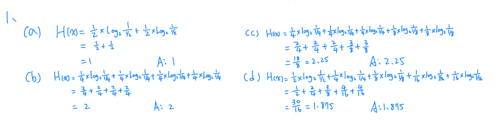
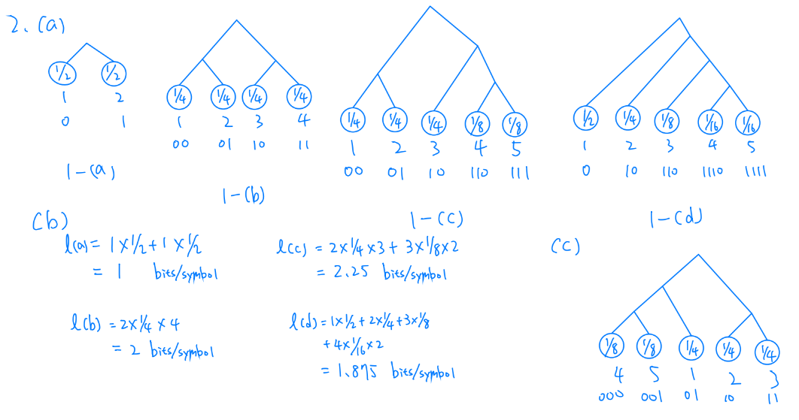
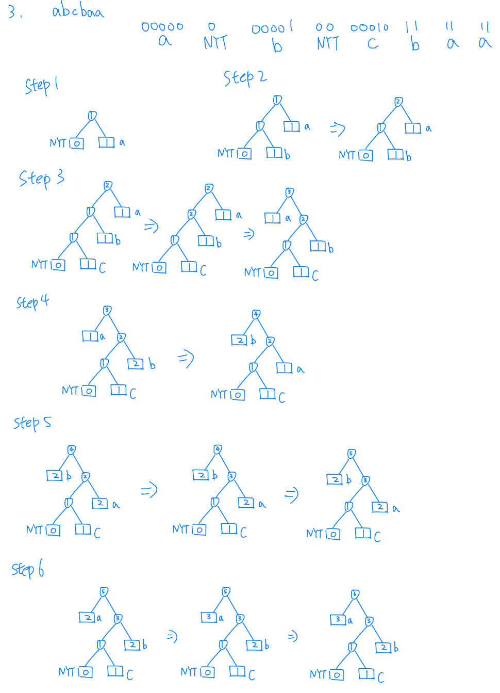
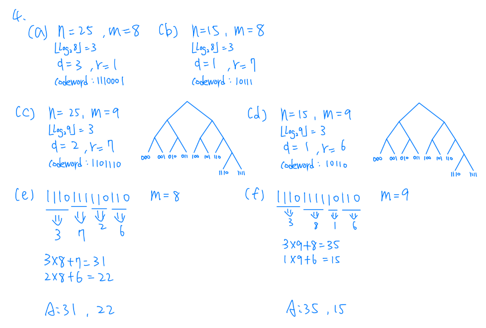
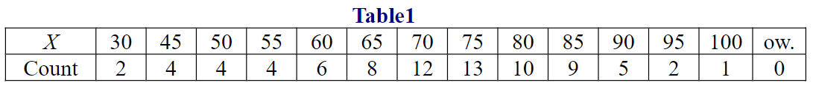
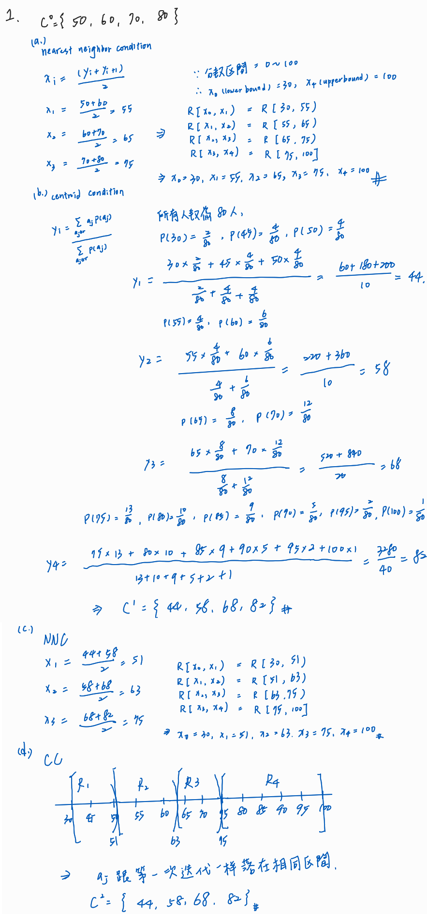
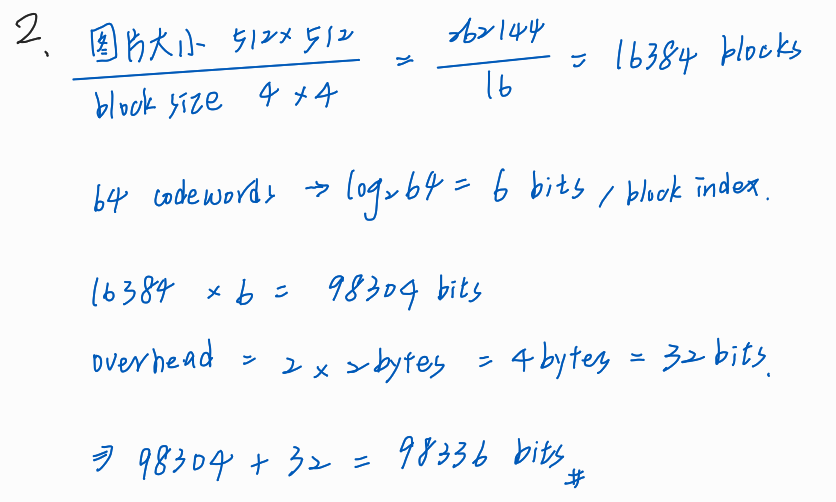
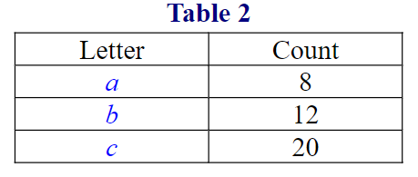
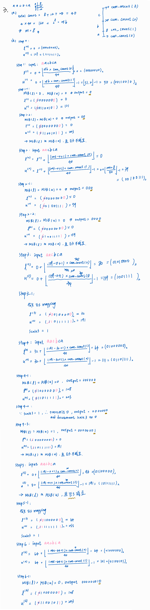

### TL; DR

紀錄修習資料壓縮這堂課的作業的解法。
<!--more-->

### 作業一

1. Let X be a random variable with an alphabet H={1,2,3,4,5}. Please determine H(X) for the
following three cases of probability mass function p(i)=prob[X=i]  
(a) p(1) = p(2) = 1/2  
(b) p(i)=1/4, for i=1,2,3,4  
(c) p(i)=1/4, for i=1,2,3, and p(4)= p(5) = 1/8  
(d) p(i)=2^-i, for i=1,2,3,4, and p(5)=1/16  

2. Design a Huffman code C for the source in Problem 1.  
(a) Specify your codewords for individual pmf model in Problem 1.  
(b) Compute the expected codeword length and compare with the entropy for your codes in (a).  
(c) Design a code with minimum codeword length variance for the pmf model in Problem 1.(c).  
Please notice that the following requirements should be satisfied when constructing the Huffman tree.  
	(1). Symbols with larger probability are moved to the left side, while symbols with smaller probability are moved to the right side each time two probabilities are combined.  
	(2). Move ever combined probability to the left side as possible among the group with the same probability.  
	(3). After completion of the Huffman tree, the left branches are assigned a “0”, while the right branches are assigned a “1”.

	
3. Let X be a random variable with an alphabet H={a,b,c,...,z}, i.e., the 26 lower-case letters. Use adaptive Huffman tree to find the binary code for the sequence a b c b a a.  
You are asked to use the following 5bits fixed-length binary code as the initial codewords for the 26 letters. That is  
a: 00000  
b: 00001  
...  
z: 11001  
Note: Show the Huffman tree during your coding process.  

4. Golomb encoding and decoding.  
(a) Find the Golomb code of n=25 when m=8  
(b) Find the Golomb code of n=15 when m=8  
(c) Find the Golomb code of n=25 when m=9  
(d) Find the Golomb code of n=15 when m=9  
(e) A two-integer sequence is encoded by Golomb code with m=8 to get the bitstream 1110111110110. What’s the decoded two-integer sequence?  
(f) A two-integer sequence is encoded by Golomb code with m=9 to get the bitstream 1110111110110 (the same bitstream as that in (e)). What’s the decoded two-integer sequence?  
Hint: The unary code for a positive integer q is simply q 1s followed by a 0.

### 作業二

1. Let X be a discrete random variable that represents the score of students in the course “Data Compression”. The total score is 100, and the distribution of X is given below. Suppose we are using the Lloyd-Max algorithm, i.e., Nearest Neighbor Condition and Centroid Condition, to find a 4-point scalar quantizer of X. That is, we are trying to find out the four quantization regions, R1[x0, x1), R2[x1, x2), R3[x2, x3), R4[x3, x4] as well as the reconstructed value y1, y2, y3, y4 corresponding to the four quantization regions. The initial codebook C^0 is given by C^0={50, 60, 70, 80}.

	(a) Determine the four quantization regions, R1,R2,R3,R4 after the first iteration, i.e.,
	what’s the value of x0,x1,x2,x3,x4 after the first iteration?  
	(b) Determine the codebook C^1 after the first iteration, i.e., what’s the value of the
	four reconstructed values, y1,y2,y3,y4 after the first iteration?  
	(c) Determine the four quantization regions, R1,R2,R3,R4 after the second iteration, i.e., what’s the value of x0,x1,x2,x3,x4 after the second iteration?  
	(d) Determine the codebook C^2 after the second iteration, i.e., what’s the value of the
	four reconstructed values, y1,y2,y3,y4 after the second iteration?  
	Note: During the scalar quantization process, each quantization region does not contain the right bound of the region, (i.e., the right bound or upper bound of a quantization bin is an open interval) except the rightmost overload region.

	

2. Given an 8-bit gray scale image with dimension 512 x 512. Suppose we are using Vector Quantization for the compression of the image with block size 4x4 (i.e., codeword dimension is 4x4), and the codebook size 64. During the coding procedure, the image width and image height are encoded each with 2 bytes and then transmitted as an overhead so that the decoder can know the dimension and reconstruct the image correctly. Moreover, we assume that the decoder also has the same codebook as encoder, so that the codebook does not have to be transmitted to the decoder.  
Please determine the number of bits that should be transmitted if fixed length code is used
for the encoding of the codeword index.  

	
	
3. Given the frequency counts shown in Table 2   
	(a) What is the smallest word length m required for unambiguous integer encoding?  
	(b) Use integer implementation to find the binary code for the sequence a a c b c a.  
	(c) Is E3 mapping ever used for this source? Justify your answer.  
Hint: You can send the lower bound of the last symbol for the termination of the encoding
process.  

	