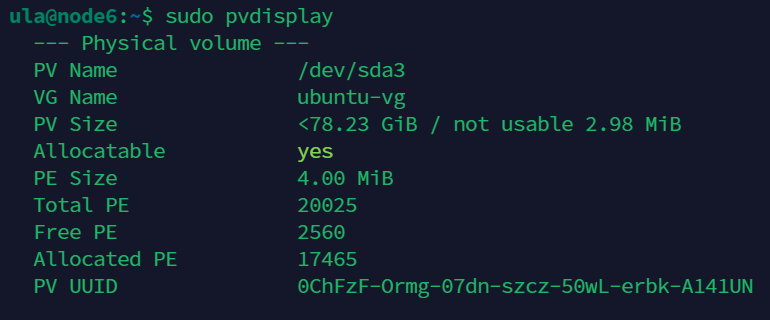
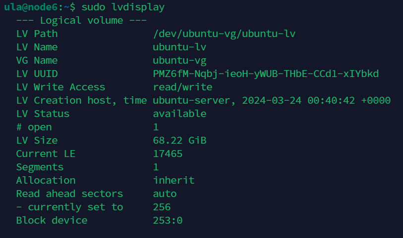
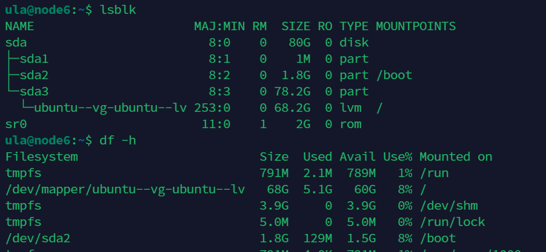

### TL; DR

記錄在 vmware 擴充硬碟空間後，如何在 Ubuntu 設定擴充根目錄大小。

<!--more-->

### 擴充 partition

```sh
sudo parted
```

```sh

GNU Parted 3.4
Using /dev/sda
Welcome to GNU Parted! Type 'help' to view a list of commands.

# 印出當前配置
(parted) print                                                            
Model: VMware, VMware Virtual S (scsi)
Disk /dev/sda: 85.9GB
Sector size (logical/physical): 512B/512B
Partition Table: gpt
Disk Flags: 

Number  Start   End     Size    File system  Name  Flags
 1      1049kB  2097kB  1049kB                     bios_grub
 2      2097kB  1904MB  1902MB  ext4
 3      1904MB  21.5GB  19.6GB

# 變更 partition 大小
(parted) resizepart

# 選擇第三個 partition
Partition number? 3

# 使用剩餘所有可用空間                                                      
End?  [18.7GB]? 85.9GB
                                               
# 離開
(parted) quit                                                             
```

### 擴充 pv (physical volumn)

```sh
sudo pvresize /dev/sda3
```



### 擴充 lv (logical volumn)

```sh
# 使用剩餘所有可用空間
sudo lvextend -l 100%FREE /dev/ubuntu--vg-ubuntu--lv

# 調整 ext4 檔案系統大小
sudo resize2fs /dev/ubuntu-vg/ubuntu-lv
```



### Result



### Reference
- https://godleon.github.io/blog/Linux/Linux-extend-lvm-from-unused-space/