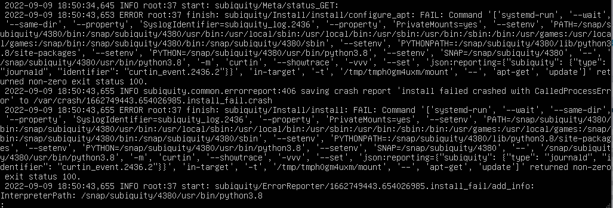

### TL; DR
剛好有機會拿到一台規格比較高的機器，所以安裝了 ESXi 8 來切多個 VM 使用，但在安裝後建 VM 卻遇到一些問題，僅此紀錄。
<!--more-->


### 問題及解決方法
1. 在安裝 Ubuntu VM 時發生 `ERROR root:xx finish: subiquity/...` 的錯誤。
	
	查看詳細 full report 結果如下
	
	參考到這篇[文章](https://askubuntu.com/questions/1296787/curtin-error-on-autoinstall-ubuntu-20-04-1)，了解到很可能是網卡的問題，進入網路管理頁面後發現果不其然的，這台機器跟其他正常的 ESXi host 不一樣，除了有兩張網卡外，原本使用的 vmnic0 這張的 mac address 有異常。
	
	故重新插入另一個網孔，並進入 BIOS 關閉舊網卡。不過再重新安裝 VM 後，仍然遇到一樣的錯誤，且都是在最後一步設定使用者的時候。故再重新研究該篇文章的回覆，在 VM 設定頁面先移除網卡，就能順利安裝 OS。安裝完畢後，再重新加上網路介面卡選項即可。


If you're running Ubuntu server in a VM (Gnome boxes, kvm, libvirt etc). Then remove any attached NIC's before you install the OS. Otherwise install fails with the above error.



2. CPU 沒有啟用 vtx 功能
需要重新開機進入 BIOS，在 `Advanced` 列表中，將 `Intel (VMX) Virtaulization Technology` 啟用即可。


3. 在原先已經有 ESXi 的情況下，使用 USB 重灌 ESXi，舊的 datastore 沒有清乾淨，無法移除 `VMFSL` 分割區。
即使使用 ssh 進入 ESXi host terminal，使用 `partedUtil delete /vmfs/devices/disks/<disk_name> <partition_number>` 命令來刪除分割區，會返回下述錯誤。
```
Error: Read-only file system during write on /dev/disks/t10.ATA_____ST500DM0022D1BD142___________________________________Z3TPTCPA
Unable to delete partition 7 from device /vmfs/devices/disks/t10.ATA_____ST500DM0022D1BD142___________________________________Z3TPTCPA
```
最終參考這篇[文章](https://communities.vmware.com/t5/ESXi-Discussions/Error-Read-only-file-system-during-write-on-dev-disks-naa-tried/td-p/1287045) 的回覆，利用 Windows10 安裝時會先格式化硬碟的功能，將磁碟清乾淨後，在重裝一次 ESXI。

### 補充
在還沒有發現是網卡問題時，還朝了更新 BIOS 的方式解決，雖然不是主因，但第一次更新 BIOS 還是挺值得紀錄的。方式很簡單，參考[官網](https://www.asus.com/tw/support/faq/1012815/)步驟
1. 準備 BIOS 檔案的 USB 隨身硬碟
2. 進入 BIOS 中更新的地方，以 ASUS 為例為 Advanced Mode 中的 `EZ Flash 3 Utility` 中。
3. 選擇 USB 隨身硬碟的檔案位置
4. 系統就會開始更新了
