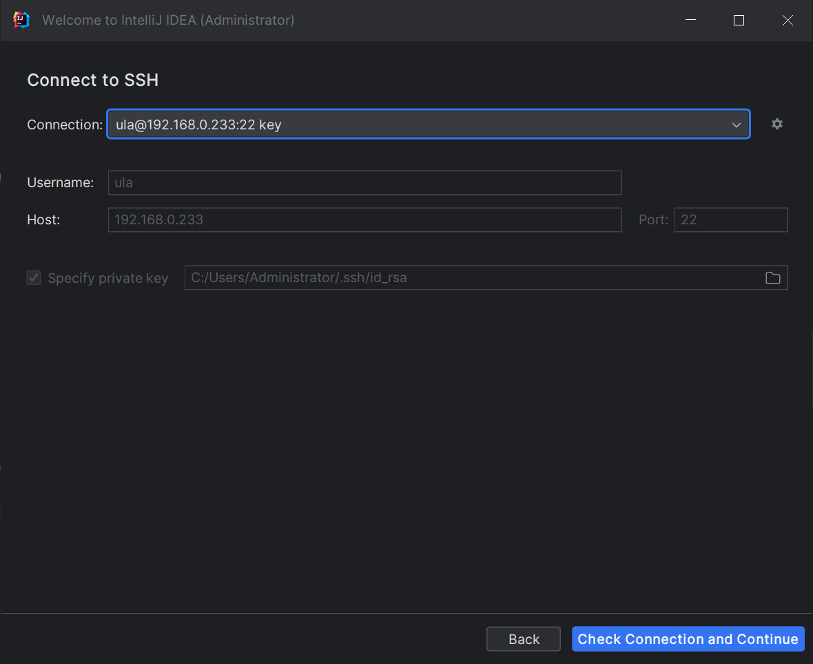

### TL; DR
嘗試在本地跑一個 Flink Job，結果遇到幾個問題，特此記錄下解決過程。
<!--more-->

### Remote SSH 無法使用

使用 Remote SSH 開啟專案，在測試連線時有成功通訊，但選擇 `Check Connection and Continue` 後一直無法跳轉。



### 解決方法

設定 Remote host 的 ssh config，將 `AllowTcpForwarding` 選項打開。

```bash
sudo vi /etc/ssh/sshd_config
# 將 AllowTcpForwarding yes unmark
systemctl restart sshd
```

### 引入的包版本不符

在 build 的時候遇到

```bash
[ERROR] Failed to execute goal on project quantalink-quickstart-connector-oracle: Could not resolve dependencies for project com.regy:quantalink-quickstart-connector-oracle:jar:1.0-SNAPSHOT: The following artifacts could not be resolved: com.ververica:flink-connector-oracle-cdc:jar:2.4-SNAPSHOT (absent): Could not find artifact com.ververica:flink-connector-oracle-cdc:jar:2.4-SNAPSHOT -> [Help 1]
```

### 解決方法

根據錯誤輸出，在相對應的 pom.xml 檔中把對應 jar 換掉。

```xml
<dependency>
  <groupId>com.ververica</groupId>
  <artifactId>flink-sql-connector-oracle-cdc</artifactId>
  <version>2.4.0</version>
</dependency>
```

### 外部類別在 IDEA Run 時找不到

build 完 project 後看 IDEA 介面，這個 jar 事實上已經被載入了，但就是運行偵錯時候報錯找不到。

### 解決方法

因為專案預設設定了部分 jar 用 provided 註解掉，這表示 provided 表示該套件只在編譯和測試的時候用。

如果想要 Run 調試，還不希望修改 pom 文件，則需要在 IntelliJ IDEA 中做相關設定：

`Run` / `Configuration` / `Use classpath of module`，勾選 `Include dependencies with “Provided” scope`。這樣調試時候可以用到，又不用修改 pom 文件了。