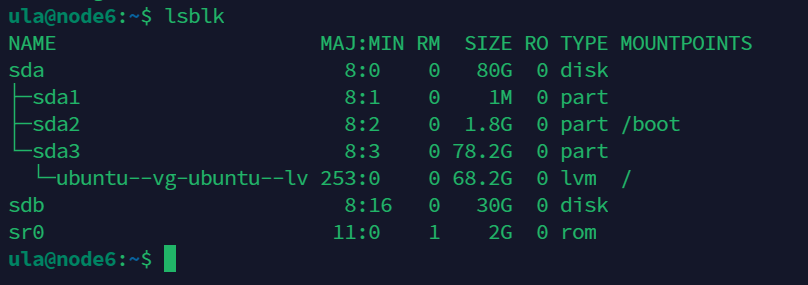

環境 為 Workstation 17 Pro，針對要加硬碟的 Ubuntu VM 執行以下操作：

Virtual Machine Settings > Add… > Hard DIsk > SCSI > Create a new virtaul disk > enter size ex. 30GB, Split virtual disk into multiple files > Finish


<!--more-->

接著在 Ubuntu 中重新掃描 SCSI

```bash
for host in /sys/class/scsi_host/host*; do echo "- - -" | sudo tee $host/scan; done
```

